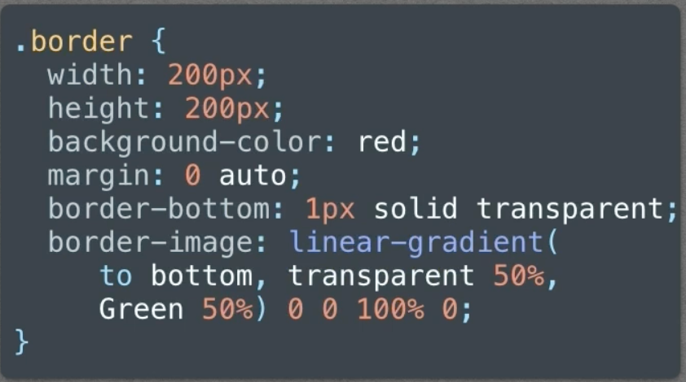
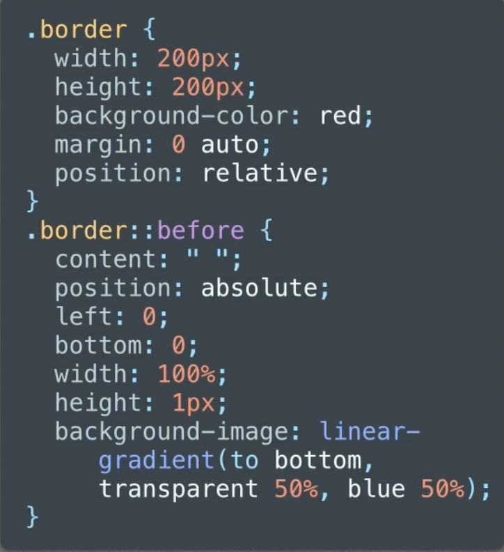
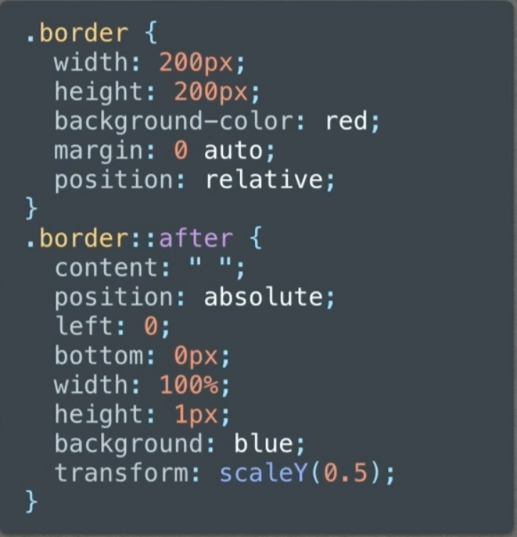
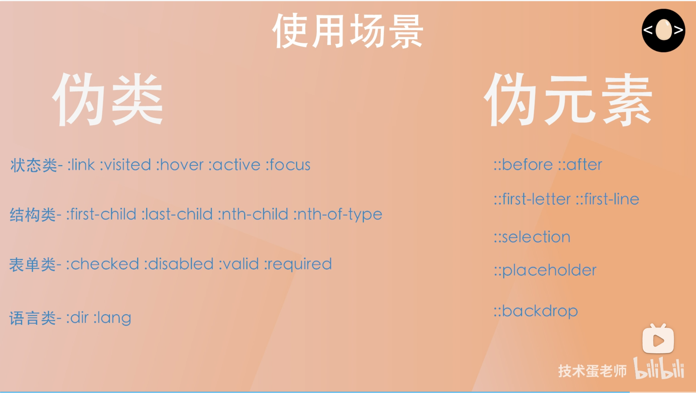
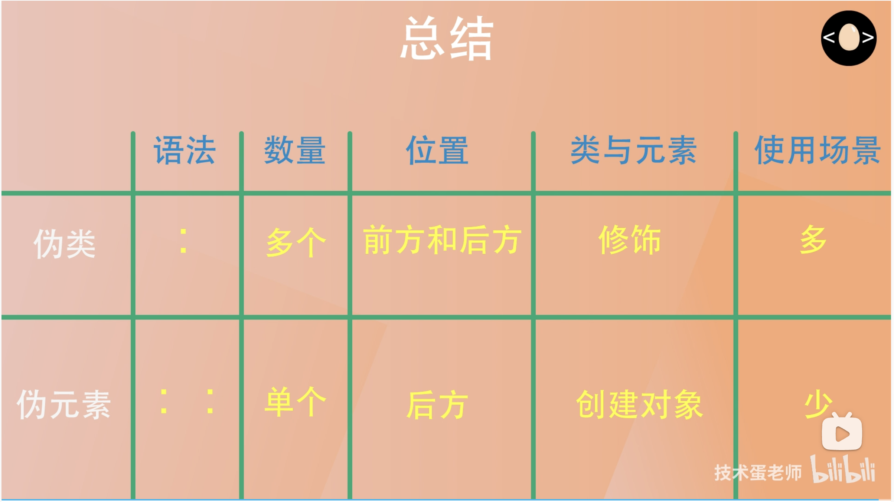

## **1.粘性定位**
[position:sticky](https://www.bilibili.com/video/BV1C8411Q7Gm/?spm_id_from=333.337.search-card.all.click&vd_source=78435c3cefd4783245d9d16d09d19859)

## **2.will-change**
`will-change` 是 CSS 中的一个属性，用于告诉浏览器某个元素即将发生变化，从而允许浏览器提前进行优化。这可以提高动画和过渡的性能，减少重绘和重排的次数。

### 语法
```css
.element {
    will-change: property;
}
```

### 可用的属性值
- `auto`：默认值，表示不进行任何优化。
- `scroll-position`：表示元素的滚动位置可能会改变。
- `contents`：表示元素的内容可能会改变。
- `transform`：表示元素的变换（如旋转、缩放）可能会改变。
- `opacity`：表示元素的不透明度可能会改变。
- `left`、`top`、`right`、`bottom`、`width`、`height` 等：表示这些具体的 CSS 属性可能会改变。

### 示例
```css
.box {
    will-change: transform, opacity; /* 提前告知浏览器将要进行变换和不透明度变化 */
}
```

### 使用注意事项
1. **性能优化**：使用 `will-change` 可以提高性能，但过度使用可能导致内存消耗增加，因此应谨慎使用。
2. **及时移除**：在不再需要优化时，最好移除 `will-change` 属性，以避免不必要的资源占用。

## **3.标准盒模型和IE盒模型**
1. **标准盒模型（W3C盒模型）**：box-sizing: content-box 指定使用标准盒模型。
- 在标准盒模型中，元素的宽度和高度只包括内容区域。内边距、边框和外边距不包括在内，它们会额外添加到内容区域的尺寸上。
2. **IE盒模型（怪异盒模型）**：box-sizing: border-box 指定使用IE盒模型。
- 在IE盒模型中，元素设置的宽度和高度包括内容、内边距和边框，但不包括外边距。这意味着，元素的实际宽度是宽度值加上左右内边距和边框的宽度。

## **4.权重**
1. !important (10000)
2. 内联（1000）
3. ID选择器（0100）
4. 类选择器（0010）
5. 标签选择器（0001）

## **5.BFC**
[css可视化模型](https://juejin.cn/post/6844903574535667719#heading-44)

### 如何触发 BFC？
1. 根元素
2. float属性不为none
3. position为absolute或fixed
4. display为inline-block, flex, inline-flex，table，table-cell，table-caption，grid
5. overflow不为visible

### 特点
1. 内部box在垂直方向，一个接一个的放置
2. box的垂直方向由margin决定，属于同一个BFC的两个box间的margin会重叠
3. BFC区域不会与float box重叠（可用于排版)
4. BFC就是页面上的一个隔离的独立容器，容器里面的子元素不会影响到外面的元素。反之也如此
5. 计算BFC的高度时，浮动元素也参与计算（不会浮动坍塌）

### 作用
1. 避免外距重叠
2. 撑起父元素高度
3. 两个兄弟元素，第一个设置浮动后，会脱离文档流，下边的元素会上来被第一个元素覆盖，为第二个元素触发 BFC，则区域不会与 BFC 重叠，水平排布在期后边

## **5.小于12px问题**
1. 背景
Chrome 中文版浏览器会默认设定页面的最小字号是 12PX，英文版没有限制原由 Chrome 团队认为汉字小于 12px 就会增加识别难度中文版浏览器
与网页语言无关，取决于用户在 Chrome 的设置里（chrome://settings/languages）把哪种语言设置为默认显示语言系统级最小字号
浏览器默认设定页面的最小字号，用户可以前往 chrome://settings/fonts 根据需求更改
而我们在实际项目中，不能奢求用户更改浏览器设置
2. 解决方案
   1. `zoom`可以设置成80%.缺点是兼容性不好,火狐不支持
   2. `-webkit-transform:scale(0.8)`会有一点缩进,盒子也缩放
   3. ~~`-webkit-text-size-adjust:none`废弃了~~

## **6.1px问题**
[移动端1px问题及解决方法](https://www.bilibili.com/video/BV1R64y1i78m/?spm_id_from=333.337.search-card.all.click&vd_source=78435c3cefd4783245d9d16d09d19859)
`css` 的1px**逻辑像素**理论上在任何设备上都是**一样粗**的，之所以存在1px问题，是因为设计稿上要求移动端的`1px`边框其实是**物理像素**的`1px`,逻辑像素1px转化为对应物理像素需要乘上对应的设备像素比dpr，比如`dpr=2`,那么1px 对应的物理像素为2px,这就让ui设计师觉得边框变粗了。
- `px`不等于物理单位,只是pc端屏幕的像素密度让我们觉得`px`等于物理像素
- iphone4开始的reTina屏幕,屏幕大小没有和iphone3发生变化,但是分辨率大了一倍,此时1个css像素是等于2个物理像素的
- 用户进行屏幕缩放,屏幕放大一倍,也会导致css中的1px对应的物理像素增加1倍
- `window.devicePixelRatio`即`dpr`: 该设备上1个css像素代表多少个物理像素

## **7.如何画0.5px的线**
问题出现的原因是有些浏览器会把`0.5`px四舍五入为1
使用缩放属性默认会从中心开始向两端缩放,如果不调整origin缩放原点属性,那么一条线就会从这个线的中心向上缩`0.25px`,向下缩`0.25px`导致上下都有一点空白
```css
.line {
    height: 1px;
    transform: scaleY(0.5);
    /** x轴50%, y轴100% */
    tansform-origin: 50% 100%;
}
```




## **7. position定位问题**
1. `position: relative` 的元素不受 `filter` 影响，仍然相对于其原始位置定位。
2. 当一个元素设置为 `position: absolute` 时，它会相对于最近的具有 `position` 属性的祖先元素进行定位。如果这个祖先元素是一个具有 `filter` 的元素，那么绝对定位的元素将相对于这个父元素进行定位。
如果**没有**具有 `position` 属性的祖先元素，绝对定位的元素将相对于**视口**进行定位。
3. `position: fixed`：通常是相对于**视口**进行定位，但在**新的层叠上下文中**，它会相对于最近的具有 `position` 属性（如 `relative、absolute、fixed`）的祖先元素进行定位。
这意味着如果父元素有 `filter`，子元素的 `fixed` 定位会被“限制”在**父元素的可视区域内**。

## **8.伪类和伪元素的区别**
[css伪类和伪元素 一分钟完全掌握](https://www.bilibili.com/video/BV14X4y1t7xo/?spm_id_from=333.337.search-card.all.click&vd_source=78435c3cefd4783245d9d16d09d19859)
[CSS伪类和伪元素的区别](https://www.bilibili.com/video/BV1h7411P7Pz/?spm_id_from=333.788.recommend_more_video.10&vd_source=78435c3cefd4783245d9d16d09d19859)



## **9.flex**
[25分钟彻底弄懂CSS Flex基础布局 / CSS Flex 入门教程](https://www.bilibili.com/video/BV1A44y1Z7Bp/?spm_id_from=333.337.search-card.all.click&vd_source=78435c3cefd4783245d9d16d09d19859)