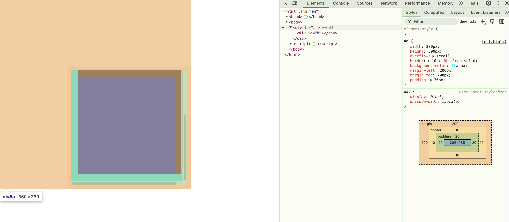

# 元素尺寸
[元素的尺寸](https://www.bilibili.com/video/BV1Yx4y1476G/?spm_id_from=333.337.search-card.all.click&vd_source=78435c3cefd4783245d9d16d09d19859)
## 读取layout tree的尺寸的属性

### 宽度和长度
**都是只读属性**
- **clientWidth**: `clientWidth = content + pending`,不包含滚动条宽度,不包含边框
- **clientLeft**: 就是左边框的宽度`borderLeft`
- **offsetWidth**: `offsetWidth = content + pending + scroll + border`,一个元素没有滚动条和`border`的话`clientWidth === offsetWidth`
- **scrollWidth**: `scrollWidth = visible + invisible`不是指元素本身的的尺寸,而是指元素里边东西的尺寸, 没有滚动条和`clientWidth`相等.`scrollWidth = content + pending`content指里边的元素的整体宽度(包括这个元素的margin),padding指包裹元素的内距

### 位置
- **offsetLeft**: 元素左边框与定位的父级元素的左边距的距离(不包含边框);父元素需要有定位，就是position需要有值;如果父级元素没有定位，则会继续往上层元素找到具有定位的元素(**只读属性**)
- **scrollTop**: 
  - **属性可修改**
  - 滚动条会影响内容区大小,比如我设置div的width为300,当出现滚动条时,内容区域的大小为285(chrome默认滚动条15px)
  - 如果容器元素有padding,内容区和滚动条之间隔着padding,width也依旧会减去滚动条的高度,得到内容区的大小
  - 内部元素的顶部(border的外侧,即包含border的宽度和内距) 到 包裹元素的可视区域**内容区顶部**(与边框和内边距无关)的距离， (求的是容器的值,而不是容器内撑开容器的属性)


- **scrollTo**: 父容器内部元素相对于父容器内容区顶部向上移动了多少
```js
const div = document.querySelector('.scrollable-div');
div.scrollTo(0, 200); // 将该元素滚动到 200px 位置

div.scrollTo({
  top: 300,
  behavior: 'smooth' // 平滑滚动到元素的 300px 位置
});
```

### 判断元素是否滚动到底了
- 假设a是容器,b是里边撑开的区域
- `a.scrollTop + a.clientHeight === a.scrollHeight`

### 跟事件属性相关的
- **event.clientX**: 鼠标相对于浏览器窗口可视区的x坐标
- **event.offsetX**: 鼠标相对于 事件源 元素(不包含边框,即鼠标的位置距离左边框内边框的距离) 的x坐标
- **event.pageX**: 鼠标相对于文档的x坐标，而非窗口坐标;**注意**：会计算滚动距离，如果没有滚动距离，则跟clientX是一样的
- **event.screenX**: 鼠标相对于**显示器屏幕**左侧位置的x坐标

## 最终经过gpu渲染的元素尺寸
- 因为有些元素还要进行`transform`变换,尺寸会与布局树不一样
```js
const rect = dom.getBoundingClientRect();
rect.width
//元素左边框相对于可视区的距离
//这个left可能是负值,一旦有横向滚动条,滚动条向右移动,元素被移动到可视区的左侧,则为负数
rect.left
```