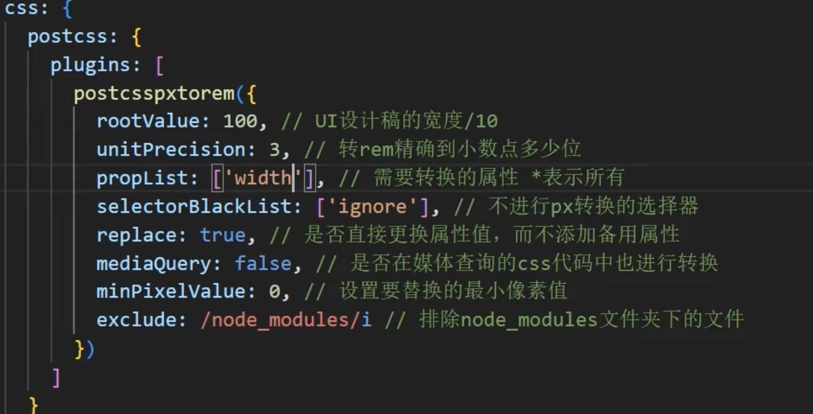
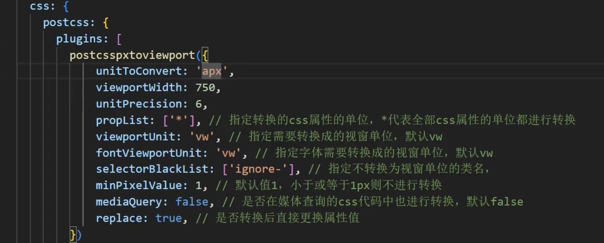

# 自适应布局
[吃透前端不同屏幕尺寸自适应](https://www.bilibili.com/video/BV1PC411372R/?spm_id_from=333.337.search-card.all.click&vd_source=78435c3cefd4783245d9d16d09d19859)
[解析移动端 rem 布局](https://www.bilibili.com/video/BV14q4y1q7sF/?spm_id_from=333.337.search-card.all.click&vd_source=78435c3cefd4783245d9d16d09d19859)
## 总体原则
1. 基本原则上是，布局更多地使用`flex`，然后尺寸使用`rem，Ww，vh`为单位
2. 如果是根据不同的屏幕需要有不同的布局了，一般通过检测屏幕尺寸**换不同的站点**或者媒体查询使用`css`

## `rem`
- 以`html`字体大小为`1rem`的大小，`html`为`16px，1rem`则`16px`。`rem`之所以能自适应就是**根据屏幕大小去用js重新设置**`html`的字体大小。
- 算法为: `html`字体大小=（js获取到的当前设备宽度/设计图宽度）* 设计图宽度下`1rem`大小
- 对应的自动转化库`-postcss-pxtorem+js`计算
```js
function getFontSize() {
    const width = Math.min(document.body.clientWidth, 750); //设计稿750px
    //即设备宽度(分辨率)和750ox设计稿的比,再乘100(位移100是因为,移动端最小的fontSize为8px,如果设备为375分辨率,则出现0.5px的根fontSize,所以乘100,此时假如设计稿的div宽为75px则应写作0.75rem,因为1rem等于100px)
    const fontSize = width / 7.5; 
    document.body.style.fontSize = fontSize + 'px';
};
getFontSize();
document.addEventListener('resize', getFontSize);
```
```css
//不使用脚本的情况根据媒体查询更换fontsize
html {
    font-size: calc(100vw/7.5);

    @media screen and (min-width: 750px) {
        font-size: 100px;
    };

    .div {
        width: .75rem
    }
}
```
- 使用`postcss-pxtorem`插件可以直接在项目里写设计稿上的`px`,插件配置`rootValue`的值为我们的根`fontsize: 100px`,自动计算每个`rem`;不需要计算的属性写在`style`里
- 也可以使用vscode插件,在写代码时帮你计算该写多少rem
[vscode插件](https://www.bilibili.com/video/BV1zM4m1U7av/?spm_id_from=333.337.search-card.all.click&vd_source=78435c3cefd4783245d9d16d09d19859)


## `vw,vh`
- `vh`一般做大屏这种项目会用到,因为这种屏幕要满屏并且不能溢出.例如按f11全屏宽度没变,高度变了,光使用`vw`并不会监测到变化
- 假设屏幕宽高为750*1200 那么 1vw就是7.5px 1vh就是12
- 使用vw做单位无需做计算，因为w会自动根据屏幕宽度变化
- vh—般用来做全屏设计
- 对应的自动转化库`-postcss-px-to-viewport`
```css
.div {
    /*设计图上750px, 1vw=7.5px 
    * 假如我的div设计图上100px
    * 那么我应该写 1vw : 7.5px
    *            x ? : 100px
    */
    width: 13.3333vw //100px/7.5px
}
```

## `rem`对比`vw`方案
- 两个方案都可以用于控制某个盒子的大小，都会根据屏幕宽度灵活变化。
- rem相对于vw灵活度更高，如果你的移动端项目还需要web端浏览，那么rem可以做到vw做不到事情。如果页面单纯是在移动端看（比如app内web）。
- 比如有些移动端项目也可以拿到`web`端去看,但展示的比例是移动端的竖向比例,如果使用`vw`,则`web`端屏幕变宽,元素比例出现问题.使用`rem`方案我们可以通过脚本限制设备的最大宽度,并且根容器写死这个`px`值
- rem不去监听`resize`事件，去修改`fontSize`是做不到动态改变屏幕宽度时变化大小的，如果你不想监听resize事件，或者你的变化触发不了`resize`，使用vw

## 百分比
百分比并不是一无是处，rem和vw都是根据屏幕去算的，如果我们需要根据父组件去缩放我们可以就必须用百分比了，比如父元素是一个用js计算出来的尺寸的盒子，我们现在希望里面的两个内容一个占百分之30，一个占百分之70.