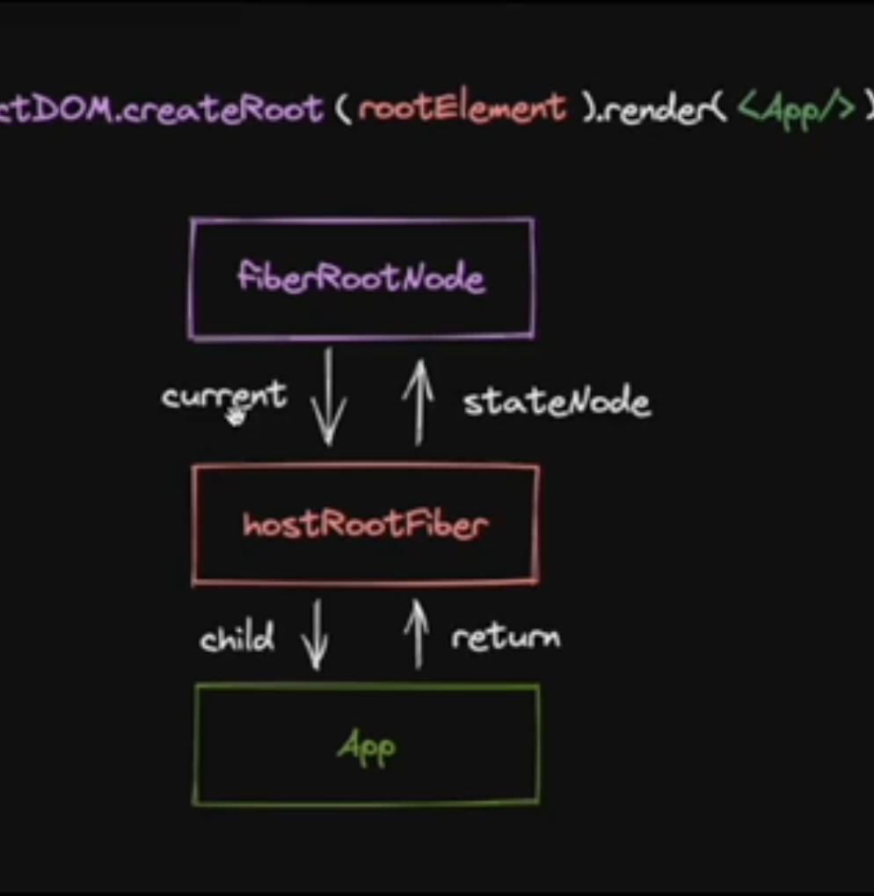

[TOC]
### 一、react 的设计理念
#### 我们认为，React 是用 JavaScript 构建==快速响应==的==大型== Web 应用程序的首选方式。它在 Facebook 和 Instagram 上表现优秀。
- **构建快速响应**，其中的关键是解决 CPU 的瓶颈与 IO 的瓶颈
  1. **CPU瓶颈**：fiber 架构，实现异步可中断，虚拟 dom，diff 算法优化渲染
  2. **IO 的瓶颈**：schedule 调度，设置优先级，提供上层 api-hooks，优化交互体验

- **大型**，其中的关键是组件化，跨端和安全性
  1. **组件化**：单项数据流，jsx 描述 ui，all in js提供更高的灵活性，组件话开发，与传统 jQuery 命令式开发不同，**声明式开发**更利于组件化。
  2. **跨端跨浏览器**：**虚拟 dom 可以**通过核心包调用**不同宿主环境的 api 给不同宿主环境**使用，本身是一个 js 库，一些**合成事件**磨平浏览器间的差异。
  3. **安全**：不直接操作 ui，提供 xss 检测，开发更加安全

---
### 二、使用 react 这个库开发和传统的使用 jQuery 开发有什么区别？

- jQuery 是过程驱动，使用 jQuery 调用宿主环境 API，来显示真实 UI
- 使用前端框架把过程驱动变为**状态(数据)驱动**
- 前端框架运行时的核心模块在调用宿主环境的 API，来显示真实 UI,开发者要做的是描述 UI
- react 的运行时的核心模块**reconciler**，描述 UI 的方法是 JSX，react 是一个纯运行时前端框架，核心模块可以开放一些通用的 API 供一些不同的宿主环境使用。批处理默认情况下在微任务中处理，开启并发更新批处理在宏任务中执行
- vue 的运行时的核心模块**renderer**，描述 UI 的方法是模版语法，模版语法可以有**编译优化**，批处理在微任务中执行

---

### 三、react核心模块操作的数据结构是？

React Element如果作为核心模块操作的数据结构，存在的问题:
- 无法表达节点之间的关系。
- 字段有限，不好拓展(比如:无法表达状态)
  
所以，需要一种新的数据结构，他的特点:

- 介于React Element与真实UI节点之间
- 能够表达节点之间的关系
- 方便拓展(不仅作为数据存储单元，也能作为工作单元)

这就是FiberNode虚拟DOM在React中的实现)
当前我们了解的节点类型:
- Jsx
- React Element
- FiberNode
- DOM Element
  
~~reconciler的工作方式对于同一个节点，比较其**React Element** 与 **fiberNode** 生成子 **fiberNode**~~。
reconciler的工作方式对于同一个节点比较当前 fiberNode的子 current Fiber 和 对应的 子React Element 生成子  wip Fiber Node
并根据比较的结果生成不同标记(插入、删除、移动.....)，对应不同宿主环境API的执行

```ts
export class FiberNode {
	pendingProps: Props;
	memoizedProps: Props | null;
	key: Key;
	stateNode: any;
	type: any;
	ref: Ref;
	tag: WorkTag;
	flags: Flags;
	subtreeFlags: Flags;
	deletions: FiberNode[] | null;

	return: FiberNode | null;
	sibling: FiberNode | null;
	child: FiberNode | null;
	index: number;

	updateQueue: unknown;
	memoizedState: any;

	alternate: FiberNode | null;

	lanes: Lanes;

	constructor(tag: WorkTag, pendingProps: Props, key: Key) {
		// 实例
        //类型如 export const FunctionComponent = 0;
		this.tag = tag;
		this.key = key;
        //对于HostComponent来说就保存了<div> div dom
		this.stateNode = null;
        //对于FunctionComponent来说就是 function 本身
		this.type = null;

		// 树结构
        //fiber当做工作单元，当前工作单元完成工作，就应该是他的父 fiber node 来执行工作 
		this.return = null;
		this.sibling = null;
		this.child = null;
		this.index = 0;

		this.ref = null;

		// 状态
		this.pendingProps = pendingProps;
		this.memoizedProps = null;
		this.updateQueue = null; //FunctionComponent上存储 effect 链表
		this.memoizedState = null;

		// 副作用
        //Placement,Update,ChildDeletion
		this.flags = NoFlags;
		this.subtreeFlags = NoFlags;
		this.deletions = null;

		// 调度
		this.lanes = NoLane;
		// this.childLanes = NoLanes;

		this.alternate = null;
	}
}
```

---

### 四、react触发更新的方法,ReactDOM.createRoot().render的流程
常见触发更新的方式：
1. ReactDOM.createRoot().render  (ReactDOM.render)
   
2. this.setState
3. useState，useReducer的dispatch方法
4. useContext

不常见的：
1. this.forceUpdate() 

[ReactDOM.createRoot().render的流程](./react.ts)

#### 整个更新流程的目的
1. 生成 wip fiberNode 树
2. 标记副作用 flags
### 五、递归，递的过程

- `beginWork`中比较当前 fiberNode的子 current Fiber 和 对应的 子React Element 生成子  wip Fiber Node
- mount/reconcile只负责 Placement(插入)/Placement(移动)/ChildDeletion(删除)
- 标记Placement的依据，fiber.alternate === null
- ？？更新（文本节点内容更新、属性更新）在completeWork中，对应Update flag
- mount 阶段只有hostfoot.fiber.child被标记了 placement
- update 阶段其他需要新增的节点也会标记placement

#### `beginWork`性能优化策略
- 一个节点下可能有很多个子节点，都标记了placement，那就要插入 dom 多次，我们可以建立好一个离屏dom 树，对 div 进行一次整体的placement操作。
- 这是针对 mount 流程的，update 流程只更新局部节点

```ts {.line-numbers}
function performUnitOfWork(fiber: FiberNode) {
	const next = beginWork(fiber, workInProgressRootRenderLane);
	// 执行完beginWork后，pendingProps 变为 memoizedProps
	fiber.memoizedProps = fiber.pendingProps;
	// 归的阶段
	if (next === null) {
		 completeUnitOfWork(fiber);
	} else {
		workInProgress = next;
	}
}

function workLoopSync() {
	while (workInProgress !== null) {
		performUnitOfWork(workInProgress);
	}
}

function workLoopConcurrent() {
	while (workInProgress !== null && !schedulerShouldYield()) {
		performUnitOfWork(workInProgress);
	}
}

function renderRoot(
	root: FiberRootNode,
	lanes: Lanes,
	shouldTimeSlice: boolean
) {
	if (__LOG__) {
		console.log(`开始${shouldTimeSlice ? '并发' : '同步'}render阶段`, root);
	}
	const prevExecutionContext = executionContext;
	executionContext |= RenderContext;

	// 初始化操作
	 (root, lanes);

	// render阶段具体操作
	do {
		try {
			shouldTimeSlice ? workLoopConcurrent() : workLoopSync();
			break;
		} catch (e) {
			console.error('workLoop发生错误', e);
			workInProgress = null;
		}
	} while (true);

	executionContext = prevExecutionContext;

	if (shouldTimeSlice && workInProgress !== null) {
		return RootIncomplete;
	}
	if (!shouldTimeSlice && workInProgress !== null) {
		console.error('render阶段结束时wip不为null');
	}

	workInProgressRootRenderLane = NoLane;
	return RootCompleted;
}
```


#### 删除过程

```ts {.line-numbers}
		const deletions = returnFiber.deletions;
		if (deletions === null) {
			returnFiber.deletions = [childToDelete];
			returnFiber.flags |= ChildDeletion;
		} else {
			deletions.push(childToDelete);
		}
```
删除节点时，除了第一个需要标记 deletion，剩下的都加入parentfiber.deletions数组中   
   - 删除节点时需要递归子树，如果子树是 functioncomponent需要执行 effect 的回调，对于 hostcomponent 需要解绑 ref，对于子组件需要找他子节点对应的 dom
   - 删除也是深度优先遍历和 beginwork and completework顺序一样
### 六、递归，归的过程

- `completeWork`
- 对于 Host 类型的 fiberNode，构建离屏 dom 树
- ？？标记 update flag
- 创建 dom 节点，并递归查找子节点，把子节点插入当前的 dom
- 创建 dom 并插入的依据 workInProgress.alternate === null && workInProgress.stateNode === null
- mount 阶段会进入上边的条件中，创建并插入 dom 到 parent 中
- update 阶段只会根据 placement 创建 dom，但不插入。
#### completeWork性能优化策略，flags分布在不同fiberNode中，如何快速找到他们?
答案:利用completeWork向上遍历(归)的流程，将子fiberNode的flags冒泡到父fiberNode
每个节点的subtreeFlags记录了子树上是否有 flags

```ts {.line-numbers}
function completeUnitOfWork(fiber: FiberNode) {
	let node: FiberNode | null = fiber;

	do {
		const next = completeWork(node);
		
		if (next !== null) {
			workInProgress = next;
			return;
		}

		const sibling = node.sibling;
		//有兄弟遍历兄弟
		if (sibling) {
			workInProgress = sibling;
			return;
		}
		//没有兄弟返回父节点
		node = node.return;
		workInProgress = node;
	} while (node !== null);
}
```

### 七、Update数据结构

```ts {.line-numbers}
//hooks
export type Update<S, A> = {|
  lane: Lane,
  action: A,
  hasEagerState: boolean,
  eagerState: S | null,
  next: Update<S, A>,
|};

export type UpdateQueue<S, A> = {|
  pending: Update<S, A> | null,
  lanes: Lanes,
   : (A => mixed) | null,
  lastRenderedReducer: ((S, A) => S) | null,
  lastRenderedState: S | null,
|};
//class
export type Update<State> = {|
  // TODO: Temporary field. Will remove this by storing a map of
  // transition -> event time on the root.
  eventTime: number,
  lane: Lane,
  tag: 0 | 1 | 2 | 3,
  payload: any,
  callback: (() => mixed) | null,
  next: Update<State> | null,
|};

export type SharedQueue<State> = {|
  pending: Update<State> | null,
  lanes: Lanes,
|};

export type UpdateQueue<State> = {|
  baseState: State,
  firstBaseUpdate: Update<State> | null,
  lastBaseUpdate: Update<State> | null,
  shared: SharedQueue<State>,
  effects: Array<Update<State>> | null,//数组。保存update.callback !== null的Update
|};
```

#### 为什么 react 中断更新后能在下一次继续使用未更新的 update 作为更新依据？
因为每次在创建 wip 时执行`createWorkInProgress`，会进行`wip.updateQueue = current.updateQueue;`,因为Update存在`UpdateQueue.shared.pending`上，所以wip 和 current fiber 中共用 update。

### 八、commit 阶段

#### 为什么首屏能一次性插入整体的 dom，而不是一个一个 placement？
在Mutation阶段,当节点有subtreeFlags时，则继续向下遍历，直到节点只有自身的 flags，然后向上遍历，此时虽然执行commitMutationEffectsOnFiber方法里会插入 dom 节点，但首屏时这些节点还没有挂在到页面上，直到遍历到根，一次性挂载

```ts {.line-numbers highlight=[15-15]}
export const commitMutationEffects = (
	finishedWork: FiberNode,
	root: FiberRootNode
) => {
	nextEffect = finishedWork;

	while (nextEffect !== null) {
		// 向下遍历
		const child: FiberNode | null = nextEffect.child;

		if (
			(nextEffect.subtreeFlags & (MutationMask | PassiveMask)) !== NoFlags &&
			child !== null
		) {
			nextEffect = child;
		} else {
			// 向上遍历
			up: while (nextEffect !== null) {
				commitMutationEffectsOnFiber(nextEffect, root);
				const sibling: FiberNode | null = nextEffect.sibling;

				if (sibling !== null) {
					nextEffect = sibling;
					break up;
				}
				nextEffect = nextEffect.return;
			}
		}
	}
};
```

### 九、FunctionComponent

#### hook存储位置，数据结构
- 存在当前functionfiber 的fiber 的memoizedState上

```ts
interface Hook {
	memoizedState: any;
	// 对于state，保存update相关数据
	updateQueue: unknown; //useState会触发更新，所以也需要 update 对象
	// 对于state，保存开始更新前就存在的updateList（上次更新遗留）
	baseQueue: Update<any> | null;
	// 对于state，基于baseState开始计算更新，与memoizedState的区别在于上次更新是否存在跳过
	baseState: any;
	next: Hook | null;
}
```
#### 为什么 hook 不能放在条件语句，要按顺序执行
- renderWithHooks时`currentlyRenderingFiber = workInProgress;`执行 hook 时如果currentlyRenderingFiber为空说明在 react 外部调用了 hook
- 当`workInProgressHook === null`时，说明是当前函数的第一个 hook，在 mount 阶段会创建 hook
- hook 以链表的形式在`Fiber.memoizedState`上进行存储，每执行完一个，指针移动到 next，所以是按顺序执行

#### useState

```ts
function dispatch(
	fiber,
	updateQueue,
	action
) {
	const update = createUpdate(action);
	enqueueUpdate(updateQueue, update);
	scheduleUpdateOnFiber(fiber);
}

function mountState(initialState) {
	const hook = mountWorkInProgressHook();
	let memoizedState;
	if (initialState instanceof Function) {
		memoizedState = initialState();
	} else {
		memoizedState = initialState;
	}
	hook.memoizedState = memoizedState;
	const queue = createUpdateQueue();
	hook.updateQueue = queue;

	// @ts-ignore
	const dispatch = dispatchSetState.bind(
		null,
		currentlyRenderingFiber,
		queue
	));

	return [memoizedState, dispatch];
}

function updateState<State>(): [State, Disptach<State>] {
	const hook = updateWorkInProgressHook();
	const queue = hook.updateQueue as UpdateQueue<State>;
	const baseState = hook.baseState;

	// 缺少render阶段更新的处理逻辑

	hook.memoizedState = processUpdateQueue(
		baseState,
		queue,
	);
	return [hook.memoizedState, queue.dispatch as Disptach<State>];
}
```

#### 单节点更新流程

1. key 是否相同
2. type 是否相同
3. 都相同复用
4. 删除节点时，除了第一个returnFiber需要标记 deletion，剩下childFiber的都加入parentfiber.deletions数组中   
   - 删除节点时需要递归子树，如果子树是 functioncomponent需要执行 effect 的回调，对于 hostcomponent 需要解绑 ref，对于子组件需要找他子节点对应的 dom
   - 删除也是深度优先遍历和 beginwork and completework顺序一样


### 十、diff

#### 单节点 diff
- 当前支持的情况：
• A1->B1
• A1->A2
- 希要支持的情况：
• АВС -> А
「单/多节点」是指「更新后是单/多节点」。
- 更细致的，我们需要区分4种情况：
• key相同，type相同 == 复用当前节点
例如：A1B2C3 -> A1
• key相同，type不同 == 不存在任何复用的可能性
例如：A1B2C3->B1
• key不同，type相同 == 当前节点不能复用，但是可能以前的兄弟节点能复用
• key不同，type不同 == 当前节点不能复用
#### 多节点 diff
在日常开发中，相较于新增和删除，更新组件发生的频率更高。所以Diff会优先判断当前节点是否属于更新。
基于以上原因，Diff算法的整体逻辑会经历两轮遍历：

**第一轮遍历**：处理更新的节点。
第一轮遍历步骤如下：
1. let i = 0，遍历newChildren，将newChildren[i]与oldFiber比较，判断DOM节点是否可复用。
2. 如果可复用，i++，继续比较newChildren[i]与oldFiber.sibling，可以复用则继续遍历。
3. 如果不可复用，分两种情况：
   - key不同导致不可复用，立即跳出整个遍历，第一轮遍历结束。
   - key相同type不同导致不可复用，会将oldFiber标记为DELETION，并继续遍历
4. 如果newChildren遍历完（即i === newChildren.length - 1）或者oldFiber遍历完（即oldFiber.sibling === null），跳出遍历，第一轮遍历结束。

对于第一轮遍历的结果，我们分别讨论：
1. newChildren与oldFiber同时遍历完
那就是最理想的情况：只需在第一轮遍历进行组件更新。此时Diff结束。
2. newChildren没遍历完，oldFiber遍历完
已有的DOM节点都复用了，这时还有新加入的节点，意味着本次更新有新节点插入，我们只需要遍历剩下的newChildren为生成的workInProgress fiber依次标记Placement。
3. newChildren遍历完，oldFiber没遍历完
意味着本次更新比之前的节点数量少，有节点被删除了。所以需要遍历剩下的oldFiber，依次标记Deletion。
4. newChildren与oldFiber都没遍历完
这意味着有节点在这次更新中改变了位置。

**第二轮遍历**：处理剩下的不属于更新的节点。
1. 为了快速的找到key对应的oldFiber，我们将所有还未处理的oldFiber存入以key为key，oldFiber为value的Map中。
2. 遍历newChildren，找到对应 map 中的oldFiber，假如 map 中oldFiber的索引为 0，则lastPlacedIndex = 0， （lastPlacedIndex为最后一个可复用节点的索引）
3. 继续遍历newChildren的下一个元素，如果在 map 中找到可以复用的节点，对比他的 index，如果 index > lastPlacedIndex,则更新lastPlacedIndex，如果小于则为当前复用的 fiber 标记 placement。
4. 遍历完成后， map 中未复用的标记删除，未找到可复用节点的在遍历过程中都标记新增。

多节点要支持的情況：
• 插入 Placement
• 别除 ChildDeletion
• 移动 Placement

整体流程分为4步。
1. 将current中所有同级fiber保存在Map中
2. 追历newChild数组，对于每净遍历到的element，存在两种情況：
   - a.在Map中存在对应current fiber，且可以复用
   - b.在Map中不存在对应current fiber，或不能复用
3. 判断是插入还是移动最后Map中剩下的都标记删除

#### commit阶段如何处理位置更新的节点？
- 首先判断当前标记新增的节点是否有slibing节点
- 有sibling的执行`insertChildToContainer`即`container.insertBefore(child, before);`
  - 查找时要看都一个元素是否是稳定节点，例如当前元素的后边元素也是要 placement 的，则再找后一位然后`insertBefore`
  - 如果一个元素，没有同级节点，还需要找父元素的兄弟节点，例如这种情况
  ```jsx
  <App/><div/>
  function App() {
	return <A/>
  }
  ```
- 没有的执行`appendChildToContainer`

```ts
const commitPlacement = (finishedWork: FiberNode) => {
	if (__LOG__) {
		console.log('插入、移动DOM', finishedWork);
	}
	const hostParent = getHostParent(finishedWork) as Container;

	const sibling = gethostSibling(finishedWork);

	// appendChild / insertBefore
	insertOrAppendPlacementNodeIntoContainer(finishedWork, hostParent, sibling);
};
function insertOrAppendPlacementNodeIntoContainer(
	fiber: FiberNode,
	parent: Container,
	before?: Instance
) {
	if (fiber.tag === HostComponent || fiber.tag === HostText) {
		if (before) {
			insertChildToContainer(fiber.stateNode, parent, before);
		} else {
			appendChildToContainer(fiber.stateNode, parent);
		}
		return;
	}
	const child = fiber.child;
	if (child !== null) {
		insertOrAppendPlacementNodeIntoContainer(child, parent, before);
		let sibling = child.sibling;

		while (sibling !== null) {
			insertOrAppendPlacementNodeIntoContainer(sibling, parent, before);
			sibling = sibling.sibling;
		}
	}
}
```
