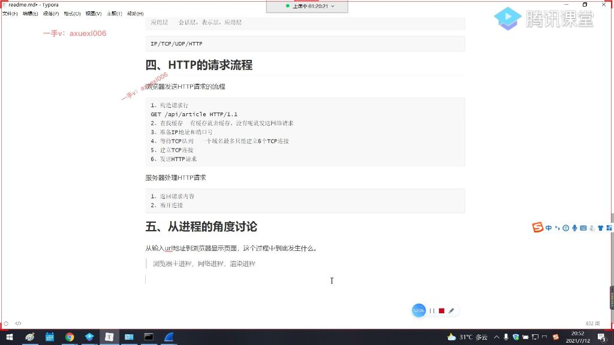

[TOC]

## 二级标题, 符号使用半角符号+ 空格更符合规范
## 这个标题拥有 1 个 id {#my_id}
## 这个标题有 2 个 classes {.class1 .class2}
### 三级标题

# 字体相关
*斜体语句* 使用cmd+ I，或者直接** 或 _也可以斜体_ 
**强调语句** 使用cmd+ B，或者直接** 或 __也可以强调__ ,不强调样式
***斜体加强调语句*** 使用cmd+ I 然后再 cmd+ B ，或者直接*** 或 ___也可以强调___
==高亮==

~~删除语句~~, 是半角~~

- 特殊数学符号等 30^th^, 2^8^, H~2~O

### 悬浮注释
*[HTML]: Hyper Text Markup Language 这是注释
*[W3C]: World Wide Web Consortium
The HTML specification
is maintained by the W3C.

---

# 列表相关

- 无序列表可以使用- or + 加空格
- 回车后自动增加列表
  - 回车后按 tab 进行下一行缩进


1. 有序列表
2. 有序列表
   1. 按 tab 也是缩进列表

### todolist
- [ ] 第一条
- [ ] this is an incomplete item
- [x] this is an incomplete item
   
---

# 链接相关

> 可以使用页脚注释[^1]

[^1]: 这里便是注释的内容

https://github.com - 自动生成
[指向百度的链接,必须要 https://开头才能跳转网页](https://www.baidu.com)

[跳转文本内的内容](#二级标题-符号使用半角符号-空格更符合规范)


---

# 代码块相关

> 这是引用
> > 引用可以嵌套

`document.getElementById // 代码行`

```javascript {.line-numbers highlight=1-4}
// 代码块
Function.prototype.myCall = function(context,...args) {
    context = context || window;
    const symbolKey = Symbol();
    context[symbolKey] = this;
    const res = context[symbolKey](...args);
    delete context[symbolKey];
    return res;
}
```

```javascript {.line-numbers highlight=[1-2 5-7]}
// 代码块
Function.prototype.myCall = function(context,...args) {
    context = context || window;
    const symbolKey = Symbol();
    context[symbolKey] = this;
    const res = context[symbolKey](...args);
    delete context[symbolKey];
    return res;
}
```


### 内联 html 代码

<h5>可以直接写html 代码</h5>
<div style="color: red">
    html代码
</div>

---

# 第一次自测
#### 字体相关 {#拥有 id 用来区分文内跳转标题}
*斜体*
**加粗**
***斜体加粗***
==高亮==
~~删除这句话~~
H~2~O
> ==前后都加^才行 2^8^==
> *[悬浮]: 悬浮内容 
> ==悬浮== 注释也忘记了,想有悬浮效果需要":",并且文本需要后边有空格 

---

#### 2列表相关

- 无序列表
  - 子列表
1. 有序列表

- [x] todolist


#### 2链接相关

[百度链接](https://baidu.com)
[文本内跳转](#字体相关-拥有-id-用来区分文内跳转标题)


==页脚注释忘记了,"^" 还有加":"==
页脚注释[^2]
[^2]: 这是第二个页脚注释的注释内容

---

#### 2代码块相关

`hello world`

> ==number忘记加 s 了== ==行号忘记加"="==
```javascript {.line-numbers highlight=[1-1 4-4]}
function abc () {
    console.log('123);

};
```

---

#### 2内联 html 代码
<h5>html</h5>
<div style="color: blue">内联代码</div>


