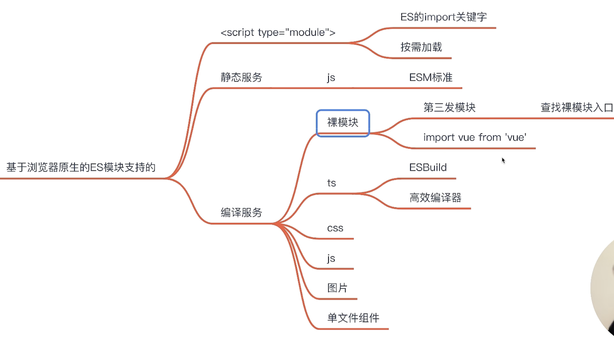

# webpack

## 1. 为什么选择 webpack？
想要理解为什么要使用 webpack，我们先回顾下历史，在打包工具出现之前，我们是如何在 web 中使用 JavaScript 的。
在浏览器中运行 JavaScript **有两种方法**。
- 第一种方式，引用一些脚本来存放每个功能；此解决方案很难扩展，因为加载太多脚本会导致网络瓶颈。
- 第二种方式，使用一个包含所有项目代码的大型 .js 文件，但是这会导致作用域、文件大小、可读性和可维护性方面的问题。
**立即调用函数表达式(IIFE)** - Immediately invoked function expressions
IIFE 解决大型项目的作用域问题；当脚本文件被封装在 IIFE 内部时，你可以安全地拼接或安全地组合所有文件，而不必担心作用域冲突。
IIFE 使用方式产生出 Make, **Gulp, Grunt**, Broccoli 或 Brunch 等工具。这些工具称为**任务执行器**，它们将所有项目文件拼接在一起。
但是，修改一个文件意味着必须**重新构建整个文件**。拼接可以做到很容易地跨文件重用脚本，但是却使构建结果的优化变得更加困难。**如何判断代码是否实际被使用**？
即使你只用到 lodash 中的某个函数，也必须在构建结果中加入整个库，然后将它们压缩在一起。**如何 treeshake 代码依赖**？难以大规模地实现延迟加载代码块，这需要**开发人员手动地进行大量工作**。
感谢 Node.js，**JavaScript 模块诞生了**
Node.js 是一个 JavaScript 运行时，可以在浏览器环境之外的计算机和服务器中使用。webpack 运行在 Node.js 中。
当 Node.js 发布时，一个新的时代开始了，它带来了新的挑战。既然不是在浏览器中运行 JavaScript，现在已经没有了可以添加到浏览器中的 html 文件和 script 标签。那么 Node.js 应用程序要如何加载新的代码 chunk 呢？
**CommonJS** 问世并引入了 require 机制，它允许你在当前文件中加载和使用某个模块。导入需要的每个模块，这一开箱即用的功能，帮助我们解决了作用域问题。
npm + Node.js + modules - 大规模分发模块
JavaScript 已经成为一种语言、一个平台和一种快速开发和创建快速应用程序的方式，接管了整个 JavaScript 世界。
**但 CommonJS 没有浏览器支持**。没有 live binding(实时绑定)。循环引用存在问题。同步执行的模块解析加载器速度很慢。虽然 CommonJS 是 Node.js 项目的绝佳解决方案，但浏览器不支持模块，因而产生了 Browserify, RequireJS 和 SystemJS 等打包工具，允许我们编写能够在浏览器中运行的 CommonJS 模块。
**ESM - ECMAScript 模块**
来自 Web 项目的好消息是，模块正在成为 ECMAScript 标准的官方功能。然而，浏览器支持不完整，版本迭代速度也不够快，目前还是推荐上面那些**早期模块实现**。
- **依赖自动收集**
传统的任务构建工具基于 Google 的 Closure 编译器都要求你**手动在顶部声明所有的依赖**。然而像 webpack 一类的打包工具自动构建并基于你所引用或导出的**内容推断出依赖的图谱**。这个特性与其它的如插件 and 加载器一道让开发者的体验更好。
是否可以有一种方式，不仅可以让我们编写模块，而且**还支持任何模块格式**（至少在我们到达 ESM 之前），并且可以同时处理资源和资产？
- 这就是 webpack 存在的原因。它是一个工具，可以打包你的 JavaScript 应用程序（支持 ESM 和 CommonJS），
- **可以扩展为支持许多不同的静态资源，例如：images, fonts 和 stylesheets**。
- webpack **关心性能和加载时间**；它始终在改进或添加新功能，例如：**异步地加载 chunk 和预取**，以便为你的项目和用户提供最佳体验。

## 2.chunk 是什么概念，介绍一下？
在Webpack中，Chunk（代码块）是指Webpack在构建过程中生成的**一个或多个独立的文件**，它包含了**一组相关的模块**。每个Chunk都有一个唯一的标识符，可以通过该标识符来访问和加载对应的Chunk。
Webpack根据指定的**入口文件和依赖关系图**来确定需要生成哪些Chunk。入口文件是Webpack构建的起点，而依赖关系图描述了每个模块之间的依赖关系。Webpack根据这些信息将模块分割为不同的代码块，并生成相应的Chunk。
Chunk的主要作用是**实现代码的分割和按需加载**。通过将代码拆分为多个Chunk，Webpack可以进行按需加载，只有在需要时才加载对应的Chunk，从而减少了初始加载的大小和时间。这样可以提高应用程序的性能和加载速度。
Webpack提供了多种代码分割的方式，包括使用入口配置、使用动态导入语法（如import()）和使用Webpack插件（如SplitChunksPlugin）。这些方式可以帮助开发者将代码分割为不同的Chunk，并根据实际需求进行配置和优化。
具体而言，Webpack的代码分割机制通过两种方式来创建chunk：
**静态代码分割（Static Code Splitting）**：在Webpack配置中使用`splitChunks`或`optimization.splitChunks`选项，可以将**第三方库**、**公共模块**或**重复的模块**分割成独立的chunk。这些chunk可以在多个入口文件之间共享，从而减少重复加载的代码。
**动态代码分割（Dynamic Code Splitting）**：通过使用动态导入（Dynamic Import）语法，可以将应用程序的不同部分分割成独立的chunk。例如，在React中可以使用React.lazy()函数和Suspense组件来实现动态导入和渲染。
分割成的chunk可以通过Webpack的内置功能（如代码分割插件、懒加载等）实现按需加载，即当需要时才加载对应的chunk，从而减少初始加载时间并提高网页性能。
通过使用chunk，Webpack可以自动将代码分割成更小的部分，实现按需加载和并行加载，从而提高应用程序的性能和用户体验。

## 3.在 webpack 中什么是bundle，什么是assets？他们之间什么关系
在 Webpack 中，**bundle** 和 **assets** 是两个核心概念，它们在前端构建过程中扮演着重要的角色。了解它们之间的区别以及它们的关系对理解 Webpack 的打包过程非常重要。

### 1. **什么是 Bundle？**

**Bundle** 是 Webpack 打包后的输出文件。Webpack 将应用程序中的所有模块（包括 JavaScript、CSS、图像等）按照依赖关系进行打包，最终生成一个或多个打包文件，这些打包文件就是 **bundle**。

#### 详细解释：
- **Bundle 是打包的结果**：Webpack 的主要任务就是把项目中的各种资源打包成一个或多个文件，这些打包后的文件称为 bundle。一个 bundle 通常包含多个模块和依赖项，经过优化后成为一个可以直接在浏览器中运行的文件。
- **模块和依赖的集合**：Webpack 会根据模块之间的依赖关系，把代码合并成一个大的 JavaScript 文件，这样浏览器可以一次性加载这个文件，而不需要分别加载每个模块。

### 2. **什么是 Assets？**

**Assets** 是指项目中的所有资源文件，包括 CSS、JavaScript、图像、字体、音频、视频等。这些资源文件在 Webpack 的构建过程中，会被处理、优化，最终输出到 bundle 中或者单独作为文件输出。

#### 详细解释：
- **Assets 是构建过程的输入**：在 Webpack 中，所有的资源文件都可以被视为 assets。这些文件在构建过程中可以被 Webpack 处理，例如压缩、转换、合并等。
- **不仅仅是代码**：assets 不仅仅指 JavaScript 代码，还包括 CSS、图像文件（如 `.png`、`.jpg`）、字体文件（如 `.woff`、`.ttf`）、甚至是音频和视频文件。

### 3. **Bundle 和 Assets 之间的关系**

- **Assets 是 Bundle 的组成部分**：Webpack 会根据配置文件中的 entry（入口点）加载所有依赖的 assets（资源文件），然后将它们打包到 bundle 中。例如，一个 `.js` 文件可以通过 `import` 引入 CSS 文件或者图片，这些被引入的 CSS 和图片文件就是 assets，Webpack 会根据这些依赖，将这些资源打包到最终的 bundle 中。
  
- **处理与优化**：Webpack 可以对 assets 进行各种处理和优化。例如，通过 `file-loader` 或 `url-loader`，Webpack 可以将图片或字体文件处理为可以在浏览器中直接引用的形式。如果这些文件比较小，Webpack 甚至可以将它们直接嵌入到 bundle 中（通过 Base64 编码等方式），否则它们会作为单独的文件被处理，并在 HTML 中通过 `<link>` 或 `` 标签进行引用。

### 4. **举例说明 Bundle 和 Assets 的关系**

假设我们有一个项目，其入口文件是 `index.js`，并且引用了一些 CSS 和图片：

```javascript
// index.js
import './style.css';
import logo from './logo.png';

document.body.innerHTML = ``;
```

在这个例子中：
- `index.js` 是一个 **JavaScript 资源**，即 **assets**。
- `style.css` 是一个 **CSS 资源**，也是 **assets**。
- `logo.png` 是一个 **图片资源**，也是 **assets**。

在 Webpack 构建时：
- Webpack 会把 `index.js` 和它依赖的 CSS、图片打包成一个或者多个 **bundle** 文件。
- 这些 **assets**（`style.css` 和 `logo.png`）可能会被内联到 JavaScript 中，或者单独处理并输出为独立文件。

构建完成后，`bundle.js` 可能包含了所有的 JavaScript 代码，同时 Webpack 会根据配置生成新的 `style.css` 文件，或者处理 `logo.png` 作为静态资源供页面使用。

### 5. **总结：Bundle 和 Assets 的关系**

- **Assets**：项目中的原始资源文件，如 JavaScript、CSS、图片等。
- **Bundle**：Webpack 打包输出的文件，包含了多个 assets 和模块的组合，是最终在浏览器中运行的文件。
- **关系**：Assets 是原始的资源文件，Webpack 会将这些资源处理并打包成一个或多个 bundle。Assets 可以直接包含在 bundle 中，也可以在构建过程中生成为单独的文件。

Webpack 的主要任务就是处理 assets 并生成 bundle，这个过程中可以进行代码拆分、优化、压缩等操作，来提升应用的加载性能。

---

## 4.module、chunk 、bundle 的区别

- 手写下一个一个的文件，它们无论是 `ESM` 还是 `commonJS` 或是 `AMD`，他们都是 `module`
- 当我们写的 `module` 源文件传到 `webpack` 进行打包时，`webpack` 会根据文件引用**关系**生成 `chunk` 文件，`webpack` 会对这个 `chunk` 文件进行一些操作
- webpack 处理好 `chunk` 文件后，最后会输出 `bundle` 文件，这个 `bundle` 文件包含了经过加载和编译的**最终源文件**，可以直接在浏览器中**运行**。
一般来说一个 chunk 对应一个 bundle，比如上图中的 `utils.js -> chunks 1 -> utils.bundle.js`
但也有例外，比如说上图中，我就用 `MiniCssExtractPlugin` 从 chunks 0 中抽离出了 `index.bundle.css` 文件
**总结：**
`module，chunk 和 bundle` 其实就是同一份逻辑代码在不同转换场景下的取了三个名字：
我们直接写出来的是 `module`，`webpack` 处理时是 `chunk`，最后生成浏览器可以直接运行的 `bundle`。

## 5.从入口到输出的流程
[流程](https://www.webpackjs.com/concepts/under-the-hood/)

## 6.核心库 - tapable 的设计思路与实现原理是什么？
[tapable](https://github.com/pro-collection/interview-question/issues/284)
Tapable 将事件处理函数按照钩子类型分为**同步钩子**（Sync Hook）、**异步钩子**（Async Hook）、**单向异步钩子**（Async Parallel Hook）和**多向异步钩子**（Async Series Hook）四种类型。
1. 事件订阅
```js {.line-numbers}
const { SyncHook } = require('tapable');

class MyPlugin {
  constructor(options) {
    this.options = options;
  }

  apply(compiler) {
    compiler.hooks.beforeRun.tap('MyPlugin', compiler => {
      console.log('Webpack is starting to run...');
    });

    compiler.hooks.done.tap('MyPlugin', stats => {
      console.log('Webpack has finished running.');
    });
  }
}
```
2. 事件派发
```js {.line-numbers}
compiler.hooks.beforeRun.call(compiler);
// Webpack is starting to run...

compiler.run((err, stats) => {
  if (err) {
    console.error(err);
    return;
  }

  console.log(stats);
  compiler.hooks.done.call(stats);
  // Webpack has finished running.
});
```
3. 实现
```js {.line-numbers}
class Tapable {
  constructor() {
    this.hooks = {};
  }

  // 注册事件监听函数
  tap(name, callback) {
    if (!this.hooks[name]) {
      this.hooks[name] = [];
    }
    this.hooks[name].push(callback);
  }

  // 触发事件
  call(name, ...args) {
    const callbacks = this.hooks[name];
    if (callbacks && callbacks.length) {
      callbacks.forEach((callback) => callback(...args));
    }
  }
}
```
## 7.`compiler` 和 `compilation`
```js {.line-numbers}
//创建complier实例
const compiler = webpack(config);
//1.真正的以监听模式启动webpack的编译
compiler.watch({},()=>{
    console.log('监听到文件变化，webpack重新开始编译');
});
compiler.run({},()=>{
    console.log('一次编译');
});

function webpack(options){
  //1.初始化参数：从配置文件和Shell语句中读取并合并参数,得出最终的配置对象
  //console.log(process.argv);
  let finalOptions = {...options,...shellConfig};//得出最终的配置对象
  //2.用上一步得到的参数初始化Compiler对象
  let compiler = new Compiler(finalOptions);
  //3.加载所有配置的插件
  //finalOptions.plugins.forEach();
  if(finalOptions.plugins&&Array.isArray(finalOptions.plugins)){
     for(let plugin of finalOptions.plugins){
       //刚开始的时候，就会执行所有的插件实例的apply方法，并传递compiler实例
       //所以说插件是在webpack开始编译之前全部挂载的
       //但是要到插件关注的钩子触发的时候才会执行
        plugin.apply(compiler);
     }
  }
  return compiler;
}

class Compiler {
    constructor(webpackOptions) {
        this.webpackOptions = webpackOptions;
        this.hooks = {
            run: new SyncHook(['compiler']),
            done: new SyncHook(['stats']),
            emit: new SyncHook(['compilation'])
        };
    }
    run(callback) {
        this.hooks.run.call(this);
        this.compile((stats) => {
            // 13.拿到输出资源列表assets之后，开始写入文件系统
            this.hooks.emit.call(this.compilation);
            let outputPath = this.webpackOptions.output.path;
            if (!fs.existsSync(outputPath)) fs.mkdir(outputPath, err => err);
            for (let filename in stats.assets) {
                let source = stats.assets[filename].source();
                filename = path.join(outputPath, filename);
                fs.writeFileSync(filename, source);
            }
            this.hooks.done.call(stats);
            callback(null, {
                ...stats,
                hasErrors() {
                    return false
                }
            });
        });
    }

    watch(callback) {
    
    }

    compile(callback) {
        // 4.创建compilation对象，并调用build方法开始编译
        this.compilation = new Compilation(this.webpackOptions);
        this.compilation.build(callback);
    }
}

class Compilation {
    constructor(webpackOptions) {
        this.webpackOptions = webpackOptions;
        this.modules = [];
        this.chunks = [];
        this.assets = {};
    }
    build(callback) {
        // 5.整理入口文件
        let entry = {};
        if (getType(this.webpackOptions.entry) === 'String') {
            entry.main = this.webpackOptions.entry;
        } else {
            entry = this.webpackOptions.entry;
        }

        for (let chunkName in entry) {
            let chunkEntry = path.join(baseDir, entry[chunkName]);
            // 6.从入口文件开始编译模块
            let entryModule = this.buildModule(chunkName, chunkEntry);

            // 11.根据入口文件模块生成chunk
            let chunk = {
                name: chunkName,
                entryModule,
                modules: this.modules.filter(_ => _.chunkNames.includes(chunkName)),
            };
            this.chunks.push(chunk);

            // 12.根据chunk整理输出资源列表assets
            let filename = this.webpackOptions.output.filename.replace('[name]', chunkName);
            let sourceCode = getSource(chunk);
            this.assets[filename] = {
                source() {
                    return sourceCode
                },
                size() {
                    return sourceCode.length
                }
            };

        }

        callback({
            modules: this.modules,
            chunks: this.chunks,
            assets: this.assets,
        });
    }
     // 6.从入口文件开始编译模块
    buildModule(chunkName, modulePath) {
        let moduleId = toUnixPath(path.relative(baseDir, modulePath));

        // 检查是否已经编译过此module
        let exitModule = this.modules.find(_ => _.moduleId === moduleId);
        if (exitModule) {
            if (!exitModule.chunkNames.includes(chunkName)) exitModule.chunkNames.push(chunkName);
            return exitModule;
        }

        // 创建新的module
        let module = {
            moduleId,
            chunkNames: [chunkName],
            dependencies: [],
            _source: '',
        };

        let sourceCode = fs.readFileSync(modulePath, 'utf-8');

        // 7.找到匹配的loader进行编译
        let rules, loaders = [];
        try {
            rules = this.webpackOptions.module.rules;
        } catch {
            rules = [];
        }

        for (let rule of rules) {
            if (rule.test.test(modulePath)) loaders.push(...rule.use);
        }
        loaders = loaders.reverse();

        let loaderContext = {
            hasChange: false,
            callback(err, content, map, meta) {
                this.hasChange = true
                sourceCode = content
            },
        };
        for (let loader of loaders) {
            loader = require(path.join(baseDir, loader));
            let res = loader.call(loaderContext, sourceCode);
            if (loaderContext.hasChange) {
                loaderContext.hasChange = false;
                continue;
            } else {
                sourceCode = res;
            }
        }

        // 8.抽象语法树操作，收集该模块所依赖的模块，把其中的依赖模块相对路径解析
        let ast = babelParser.parse(sourceCode, {});

        babelTraverse(ast, {
            CallExpression(nodePath) {
                if (!(nodePath.node.callee.name === 'require')) return;
                let depModulePath = path.join(path.dirname(modulePath), nodePath.node.arguments[0].value);
                let depModuleId = toUnixPath(path.relative(baseDir, depModulePath));
                nodePath.node.arguments = [babelTypes.StringLiteral(depModuleId)];
                module.dependencies.push({ depModuleId, depModulePath });
            }
        })

        // 9.抽象语法树生成回源代码
        let { code } = babelGenerator(ast);
        module._source = code;

        this.modules.push(module);
        // 10.对依赖模块进行编译
        module.dependencies.forEach(({ depModuleId, depModulePath }) => {
            this.buildModule(chunkName, depModulePath);
        });

        return module;
    }
}

function getSource(chunk){
   return `
   (() => {
    var modules = {
      ${
          chunk.modules.map(module=>`
          "${module.id}": (module,exports,require) => {
            ${module._source}
          }`).join(',')
      }
    };
    var cache = {};
    function require(moduleId) {
      if (cache[moduleId]) {
        return cache[moduleId].exports;
      }
      var module = (cache[moduleId] = {
        exports: {},
      });
      modules[moduleId](module, module.exports, require);
      return module.exports;
    }
    (() => {
     ${chunk.entryModule._source}
    })();
  })();
   `;
}
```
---
## 8.在webpack的构建过程中，compiler和compilation的作用是什么?

### 1. compiler(编译器）
- `compiler`对象可以理解为一个和 `webpack` 环境整体绑定的一个对象，它包含了所有的环境配置，包括 `options，loader` 和 `plugin`，当 `webpack` 启动时，这个对象会被实例化，并且他是全局唯一的
- `compiler` 在 `webpack` 构建之初就已经创建，并且贯穿`webpack`整个生命周 ( before - run - beforeCompiler - complie - make - finishMake - afterComplier - done)
- `compilation`是到准备编译模块时，才会创建`compilation`对象
- `compiler` 是Webpack构建过程的入口点，它负责启动整个构建流程，触发各种编译事件，并最终生成输出文件。

### 2.Compilation（编译）
- `compilation` 是Webpack每次构建过程中的一个实例，代表了一次完整的编译过程。每当Webpack开始新的构建时，都会创建一个新的`compilation`对象。`compilation`对象包含了当前构建过程的所有信息，包括模块、依赖关系、生成的资源等等。作用：
  - 跟踪模块的变化，管理模块之间的依赖关系。
  - 生成最终的输出资源，如JavaScript文件、CSS文件等。
  - 触发各种编译事件，供插件处理。例如，在模块成功编译后触发事件，插件可以在这些事件中执行自定义逻辑。
  - 记录编译过程中的警告和错误信息。
- 在使用`watch`，源代码发生改变的时候就需要重新编译模块，但是`compiler`可以继续使用
- 如果使用`compiler`则需要初始化注册所有`plugin`，但是`plugin`没必要重新注册这时候就需要创建一个新的`compilation`对象
- 而只有修改新的`webpack`配置才需要重新运行 `npm run build` 来重新生成 `compiler`对象

## 9.Webpack vs Vite的核心差异
**1. 构建速度:**
  - Webpack: Webpack的构建速度相对较慢，尤其在大型项目中，因为它需要**分析整个依赖图**，进行多次文件扫描和转译。
  - Vite: Vite以**开发模式下的极速构建著称**。它利用**ES模块**的特性，**只构建正在编辑的文件**，而不是整个项目。这使得它在开发环境下几乎是即时的。
**2. 开发模式:**
  - Webpack: Webpack通常使用热模块替换（HMR）来实现快速开发模式，但配置相对复杂。
  - Vite: Vite的开发模式非常轻量且快速，支持HMR，但无需额外配置，因为它默认支持。
**3. 配置复杂度:**
  - Webpack: Webpack的配置相对复杂，特别是在处理不同类型的资源和加载器时。
  - Vite: Vite鼓励零配置，使得项目起步非常简单，但同时也支持自定义配置，使其适用于复杂项目。
**4. 插件生态:**
  - Webpack: Webpack拥有庞大的插件生态系统，适用于各种不同的需求。
  - Vite: Vite也有相当数量的插件，但相对较小，因为它的开发模式和构建方式减少了对一些传统插件的需求。
**5. 编译方式:**
  - Webpack: Webpack使用了多种加载器和插件来处理不同类型的资源，如JavaScript、CSS、图片等。
  - Vite: Vite利用ES模块原生支持，使用原生浏览器导入来处理模块，不需要大规模的编译和打包。
**6. 应用场景:**
  - Webpack: 适用于复杂的大型项目，特别是需要大量自定义配置和复杂构建管道的项目。
  - Vite: 更适用于小到中型项目，或者需要快速开发原型和小型应用的场景。
**7. 打包原理:**
  - Webpack: Webpack的打包原理是将所有资源打包成一个或多个bundle文件，通常是一个JavaScript文件。
  - Vite: Vite的打包原理是保持开发时的模块化结构，使用浏览器原生的导入机制，在生产环境中进行代码分割和优化。

工具链的组成：
1. 开发服务器
2. 构建工具
优缺点:
**Webpack:**
- nodejs服务端的
- webpack 针对组件库可以打包umd amd 等格式
- webpack针对前端页面工程打包的结果是cjs
优点：灵活、强大、适用于复杂场景、庞大的插件生态。
缺点：构建速度较慢、配置复杂、开发体验不如Vite流畅。

**Vite:**
- vite是基于浏览器的
- Vite对项目打包后是esModule格式
- 只是因为没用babel和teaser，转译和压缩俩耗时大户被干掉了，别的流程还是一样慢，rollup也是js
- esbuild使用 go 语言编写，可以多线程打包
- 构建工具rollup
优点：极快的开发构建速度、零配置启动、原生ES模块支持、适用于小型项目和快速原型开发。
缺点：插件生态相对较小、不太适用于复杂大型项目。
