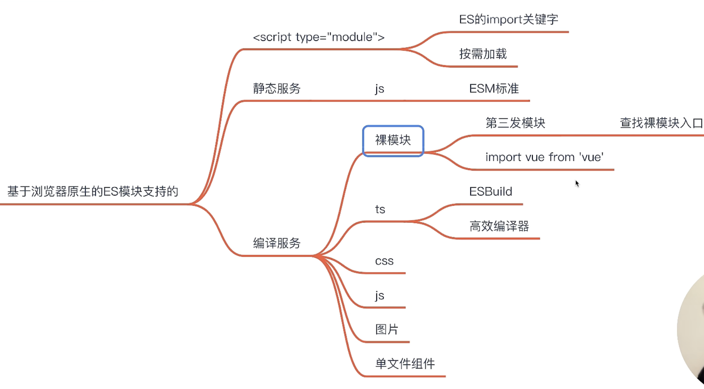

# webpack

## 1. 为什么选择 webpack？
想要理解为什么要使用 webpack，我们先回顾下历史，在打包工具出现之前，我们是如何在 web 中使用 JavaScript 的。
在浏览器中运行 JavaScript **有两种方法**。
- 第一种方式，
- 第二种方式，
**立即调用函数表达式(IIFE)** - Immediately invoked function expressions

**CommonJS** 
**但 CommonJS 没有浏览器支持**。
**ESM - ECMAScript 模块**

- **依赖自动收集**
- 这就是 webpack 存在的原因。它是一个工具，可以打包你的 JavaScript 应用程序（支持 ESM 和 CommonJS），
- **可以扩展为支持许多不同的静态资源，例如：images, fonts 和 stylesheets**。
- webpack **关心性能和加载时间**；它始终在改进或添加新功能，例如：**异步地加载 chunk 和预取**，以便为你的项目和用户提供最佳体验。

## 2.chunk 是什么概念，介绍一下？
**静态代码分割（Static Code Splitting）**：
**动态代码分割（Dynamic Code Splitting）**：

## 3.在 webpack 中什么是bundle，什么是assets？他们之间什么关系

### 1. **什么是 Bundle？**

### 2. **什么是 Assets？**


### 3. **Bundle 和 Assets 之间的关系**

---

## 4.module、chunk 、bundle 的区别


## 5.从入口到输出的流程
[流程](https://www.webpackjs.com/concepts/under-the-hood/)

## 6.核心库 - tapable 的设计思路与实现原理是什么？
[tapable](https://github.com/pro-collection/interview-question/issues/284)
Tapable 将事件处理函数按照钩子类型分为**同步钩子**（Sync Hook）、**异步钩子**（Async Hook）、**单向异步钩子**（Async Parallel Hook）和**多向异步钩子**（Async Series Hook）四种类型。
1. 事件订阅
```js {.line-numbers}

```
2. 事件派发
```js {.line-numbers}

```
3. 实现
```js {.line-numbers}

```
## 7.`compiler` 和 `compilation`
```js {.line-numbers}

```
---
## 8.在webpack的构建过程中，compiler和compilation的作用是什么?

### 1. compiler(编译器）


### 2.Compilation（编译）


## 9.Webpack vs Vite的核心差异
**1. 构建速度:**

**2. 开发模式:**

**3. 配置复杂度:**

**4. 插件生态:**

**5. 编译方式:**

**6. 应用场景:**

**7. 打包原理:**


工具链的组成：
1. 开发服务器
2. 构建工具
优缺点:
**Webpack:**
- 
- 
- 
优点：
缺点：

**Vite:**
- 
- 
- 
- 
- 
优点：
缺点：
