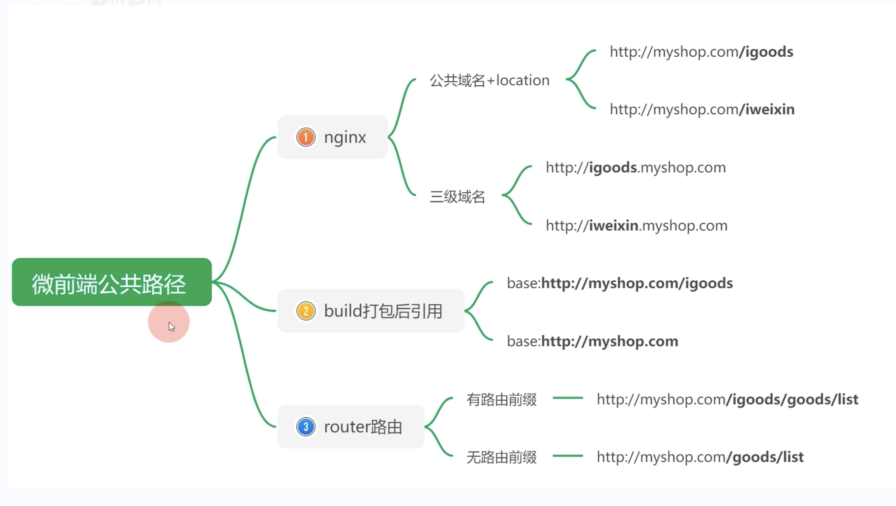
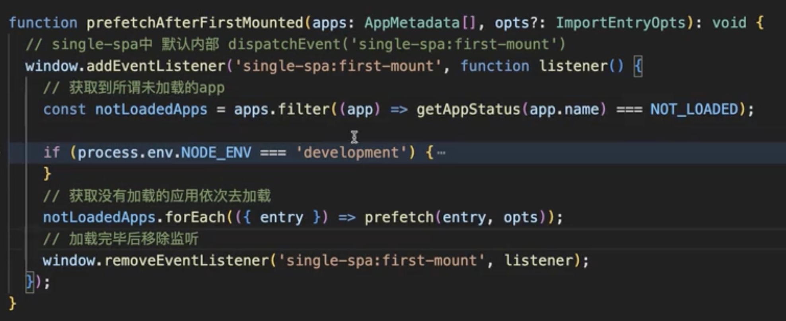
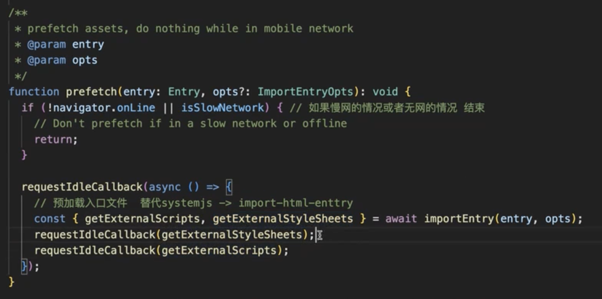
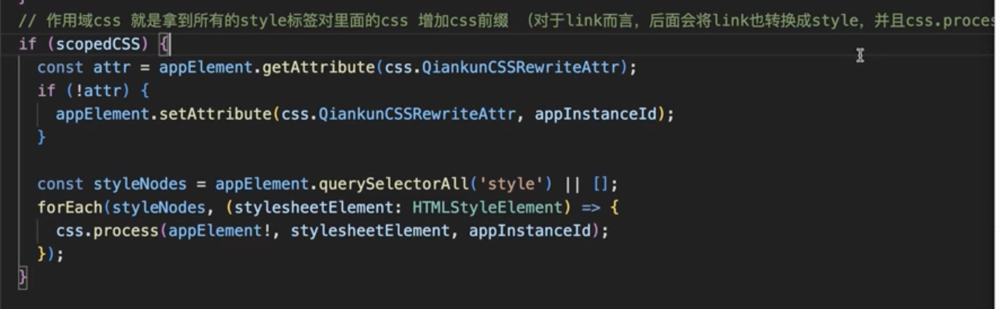

# 微前端

## **1.遇到的坑**
1. 子应用定义的生命周期函数有可能会被tree-shrking掉
   - 使用 /* webpackExports: ["methodName"] */ 注释
   - 如果你正在进行 `code splitting` 和 动态导入，而且你明确知道某些方法需要保留，可以通过 `/* webpackExports */` 指定哪些导出不应被 `Tree Shaking` 剔除。如下所示：
   ```js
   /* webpackExports: ["someMethod"] */
   export function someMethod() {
   // your logic
   }
   ```
2. 微前端公共路径
   1. vite:base
   2. webpack:public-path
3. 针对antd资源的调整：所有antd相关样式（dom class和css选择器）添加一个前缀，与父应用的antd样式区分开，避免相互影响
```javascript
// webpack.config.js
{
     loader: 'less-loader',
       options: {
         modifyVars: {
           '@ant-prefix': 'microPrefix',
         },
         javascriptEnabled: true,
       }
}
```

```javascript
// 配置 antd ConfigProvider
import { ConfigProvider } from 'antd';
export const MyApp = () => (
     <ConfigProvider prefixCls="microPrefix">
          <App />
     </ConfigProvider>
);
```
4. 重复依赖: 不同应用之间依赖的包存在很多重复，由于各应用独立开发、编译和发布，难免会存在重复依赖的情况。导致不同应用之间需要重复下载依赖，额外再增加了流量和服务端压力。
5. `webpack external` 外部扩展，可以将通用的一些包排除在bundle之外，然后使用直接访问公共包JS的方式（一般采用CDN），直接在index.html中引入，但是这样的话，公共依赖必须采用UMD格式，那用的时候也要遵循，就有点麻烦
6. 页面上不能同时显示多个依赖于路由的微应用，因为浏览器只有一个 url，如果有多个依赖路由的微应用同时被激活，那么必定会导致其中一个 404。

---

## **2.为什么不使用iframe?**
为什么不用 iframe，这几乎是所有微前端方案第一个会被 challenge 的问题。但是大部分微前端方案又不约而同放弃了 iframe 方案，自然是有原因的，并不是为了 "炫技" 或者刻意追求 "特立独行"。
如果不考虑体验问题，iframe 几乎是最完美的微前端解决方案了。
iframe 最大的特性就是提供了浏览器原生的硬隔离方案，不论是样式隔离、js 隔离这类问题统统都能被完美解决。但他的最大问题也在于他的隔离性无法被突破，导致应用间上下文无法被共享，随之带来的开发体验、产品体验的问题。
   1. **url 不同步**。浏览器刷新 `iframe url` 状态丢失、后退前进按钮无法使用。(localstorage)
   2. **UI 不同步，DOM 结构不共享**。想象一下屏幕右下角 1/4 的 iframe 里来一个带遮罩层的弹框，同时我们要求这个弹框要浏览器居中显示，还要浏览器 resize 时自动居中..
      - `iframe`的页面用`postMessage`传递的`message`中加入关于“弹窗”的位置、大小等信息，让`parent`负责去显示
      - 让上层去显示的话，所有 `popup` 就都得是上层来负责了。`message、alert、notice、dialog` 等等。`dialog` 里再加些交互，比如 `dialog` 里的表单某一个 `checkbox` 点击了，需要 `iframe` 里的页面做个其他响应，比如某个 `button` 变灰等等。
      - 子应用全程没有 UI 渲染全是各种 `postMessage` 和 `onmessage` 监听，还要保证**消息时序**，时序一乱 bug 丛生...
      - `iframe` 里的应用不被嵌还跑不起来了，因为只是个消息收发器，连自己的 UI 都没有，全都依赖宿主环境~
      - 总结就是增加了父子应用的耦合度。主应用不应该关心微服务，它们应该保持松耦合。
   3. **全局上下文完全隔离，内存变量不共享**。iframe 内外系统的通信、数据同步等需求，主应用的 cookie 要透传到根域名都不同的子应用中实现免登效果。
      - 如果是同域情况下，cookie是可以通过nginx配置到同域名下的子路由然后内部转发到子应用服务的端口。
      - 后端不应该关心前端需要怎样的实现，每增加一个微服务就莫名其妙多了一层代理，长此以往，nginx配置会是一个灾难
   4. 慢。每次子应用进入都是一次**浏览器上下文重建**、资源重新加载的过程。一个iframe等于打开一个新的网页，所有的JS/CSS全部加载一遍，内存会*2，无法释放，典型的内存泄露，假如大量子应用同屏，后果怎么样不用我说了吧。
   5. iframe会阻塞主页面的Onload事件,通过 JavaScript 动态设置 iframe的SRC可以避免这种阻塞情况，但是也很麻烦
   6. 根本没法进行seo优化
其中有的问题比较好解决(问题1)，有的问题我们可以睁一只眼闭一只眼(问题4)，但有的问题我们则很难解决(问题3)甚至无法解决(问题2)，而这些无法解决的问题恰恰又会给产品带来非常严重的体验问题， 最终导致我们舍弃了 iframe 方案。

## 做一个主页面,内嵌一个iframe,如何理解这句话"iframe 内外系统的通信、数据同步等需求，主应用的 cookie 要透传到根域名都不同的子应用中实现免登效果。"

### 1. **iframe 内外系统的通信和数据同步**

- **iframe 通信**：在现代前端开发中，主页面和内嵌的 iframe 需要相互通信，通常使用 `postMessage` API 进行跨域通信。`postMessage` 允许一个页面向另一个页面（不论它们是否在同一个域下）发送安全的消息，解决 iframe 和主页面之间无法直接访问对方数据的问题。

- **数据同步**：这涉及到主页面和 iframe 内的子应用之间的数据一致性，比如用户的状态信息、应用的某些全局设置等。主页面需要将数据传递给 iframe，或从 iframe 获取数据并保持同步。

### 2. **主应用的 Cookie 要透传到根域名都不同的子应用中**

- **跨域 Cookie 共享问题**：在浏览器中，不同的域名（例如 `example.com` 和 `sub.example.com` 或 `anotherdomain.com`）之间默认是无法共享 Cookie 的。如果主页面和 iframe 加载的子应用在不同的根域名下（例如主页面是 `example.com`，iframe 加载的页面是 `anotherdomain.com`），它们无法直接通过 Cookie 共享用户的登录状态或其他信息。

- **免登效果**：免登录意味着用户登录一次后，可以在主应用和子应用中无缝切换而不需要再次登录。这在跨域名的情况下是个挑战。为了实现免登录效果，必须找到一种方式来共享用户的登录状态（通常是通过 Cookie 或 Token）。

### 3. **如何实现免登录效果？**

为了解决这个问题，有几种常见的方案：

#### 方案 1: **OAuth 或 SSO（单点登录）**

- 如果主应用和子应用处于不同的根域名，并且要实现免登录，通常会使用 OAuth 或 SSO（单点登录）方案。通过这种方式，用户只需要在主应用登录一次，子应用可以通过 OAuth 协议获取到用户的授权信息，实现无缝登录。
- 在这种方案下，iframe 加载的子应用会向认证服务器请求用户的登录状态（通过主应用发出的 Token 或其他凭据），从而免去再次登录的步骤。

#### 方案 2: **跨域 Cookie 传递**

- **第三方 Cookie**：通常情况下，子应用可以通过设置第三方 Cookie 来共享登录状态。但现代浏览器对第三方 Cookie 有很强的安全限制，尤其是对于跨站点跟踪的防护，这个方案可能会受到限制。

- **中间服务器代理**：可以使用中间代理服务器，主页面在请求子应用时将自己的登录信息（如 Token）通过请求头或 URL 参数传递给子应用，子应用再通过该信息实现免登录。

#### 方案 3: **`postMessage` 跨域通信**

- 通过 `postMessage`，主页面可以在用户登录后将登录信息发送给 iframe 中的子应用，子应用再将该信息存储在本地（如 `localStorage` 或者 `sessionStorage`），从而实现免登录。
  
```javascript
// 主页面发送消息
const iframe = document.getElementById('myIframe');
iframe.contentWindow.postMessage({ token: 'USER_TOKEN' }, 'https://subapp.com');

// iframe 接收消息
window.addEventListener('message', (event) => {
  if (event.origin === 'https://mainapp.com') {
    const token = event.data.token;
    // 使用 token 实现免登录
  }
});
```

#### 方案 4: **同一域下的 Cookie**

- 如果主应用和子应用的域名是相同的（或可以设置为相同的顶级域），可以通过设置 Cookie 的 `Domain` 属性共享登录状态。
  - 例如，主应用是 `mainapp.example.com`，子应用是 `subapp.example.com`，可以将 Cookie 设置为 `Domain=.example.com`，这样两个子域可以共享同一个 Cookie。

---

## **3.主应用和子应用通信**
由于`qiankunshi`采用`HTML Entry`，`localStrage、cookie`可共享。
```js 主应用
import { initGlobalState, MicroAppStateActions } from 'qiankun';

// 初始化 state
const actions: MicroAppStateActions = initGlobalState(state);

actions.onGlobalStateChange((state, prev) => {
  // state: 变更后的状态; prev 变更前的状态
  console.log(state, prev);
});
actions.setGlobalState(state);
actions.offGlobalStateChange();
```

```js 子应用
// 从生命周期 mount 中获取通信方法，使用方式和 master 一致
export function mount(props) {
  props.onGlobalStateChange((state, prev) => {
    // state: 变更后的状态; prev 变更前的状态
    console.log(state, prev);
  });

  props.setGlobalState(state);
}
```
## **4.不同的微前端框架**
1. `Micro App`: Micro App 是京东出的一款基于 `Web Component` 原生组件进行渲染的微前端框架，不同于目前流行的开源框架，它从组件化的思维实现微前端，旨在降低上手难度、提升工作效率。2021-07-09
2. `Garfish`: Garfish 是由字节跳动开源的一套微前端解决方案，主要用于解决现代 web 应用在前端生态繁荣和 web 应用日益复杂化两大背景下带来的 跨团队协作、技术体系多样化、应用日益复杂化等问题，Garfish 已经经过大量的线上应用的打磨和测试，功能稳定可靠。0.0.2 (2021-02-20)其原理跟 qiankun 比较近似。
3. `wujie`: 是一个iframe + webComponent 的解决方案.1.0.0-rc.1 (2022-07-05)腾讯

## **5.微前端能解决什么问题？**
1. 兼容遗留系统
2. 可以与时俱进，不断引入优秀的新技术/新框架
3. 支持局部/增量升级，避免项目每次发布都是全量发布，即使是上线一个小模块，也可能导致整个项目挂掉
4. 代码简洁、解耦、更易维护
5. 子应用间可以自由组合拆分
6. 技术栈无关，各子应用的开发团队可自行采取熟悉的技术栈进行开发，降低开发时间和成本
7. 微前端可以采用组件或者服务的方式进行团队间的技术共享
8. 每个应用可以独立部署，独立运行，拥有故障隔离

## 6.预加载
- prefetch内部使用了`requestIdleCallback`



## 7.css样式隔离

