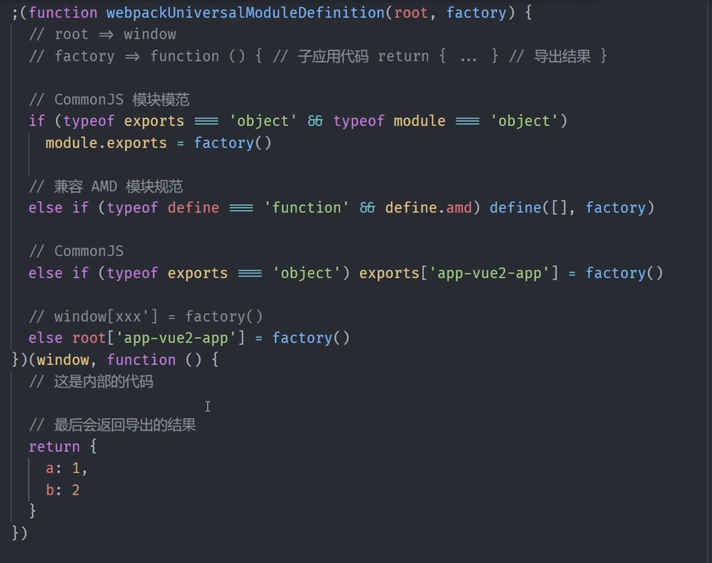

- 主应用接入子应用的`entry`如果没使用代理,则子应用需要设置`cors`支持主应用发起跨域的`fetch`请求
- `export const fetchResource = fetch(url).then(res => res.text());`在 `JavaScript` 中，使用 `fetch API` 发起请求后，可以通过 `.text()` 方法处理响应。这是 `Response` 对象的一部分，用于将响应体**解析为文本**。

;
;
;
;
;
;
;
;
;
;
;
;
;
;
;