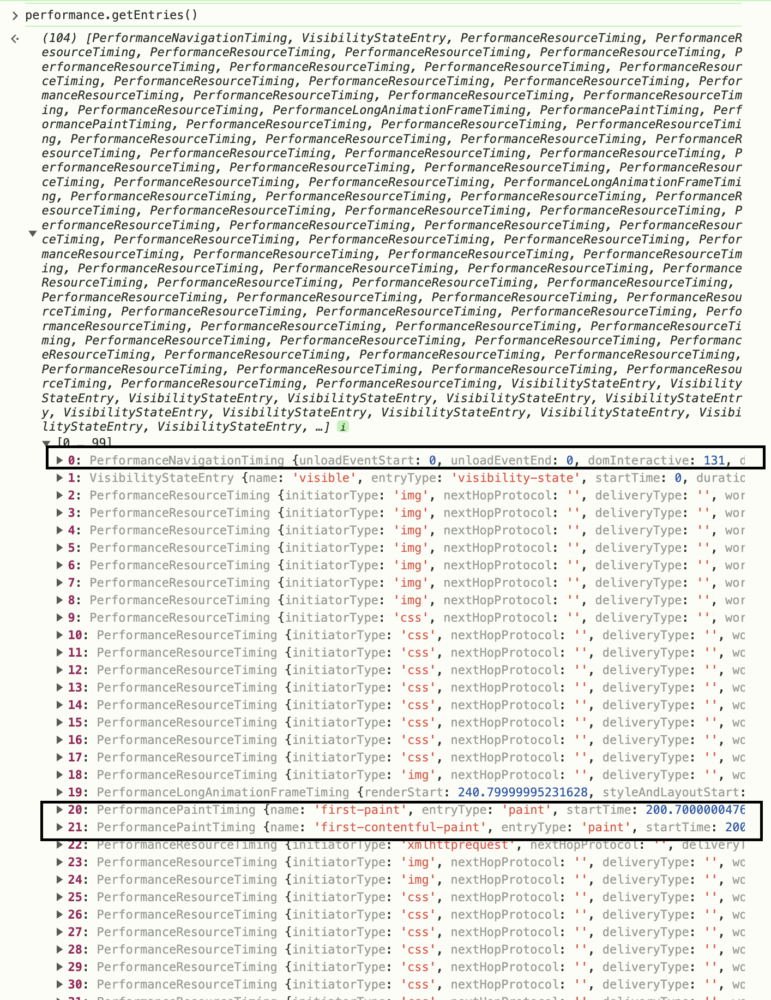

# 性能指标
[Navigation_timing](https://developer.mozilla.org/en-US/docs/Web/API/Performance_API/Navigation_timing)

## 1.衡量用户体验的RAIL模型
1. Response 响应 
2. Load 加载
3. Idle 空闲
4. Animation 动画

## 2.通过`performance`对象的`getEntriesByType`的`navigation`拿到各个时间戳
- ~~`window.performance.timing`~~是被废弃的api因为他的精度是毫秒级别,现在前端的精度都是纳秒级别
```js
//一组数据,包括PerformanceNavigationTiming,多项PerformancePaintTiming(first-paint,first-contentful-paint等),各项资源的PerformanceResourceTiming
const entries = performance.getEntries();

entries.forEach((entry) => {
  if (entry.entryType === "resource") {
    console.log(`${entry.name}'s startTime: ${entry.startTime}`);
  }
  if (entry.entryType === "measure") {
    console.log(`${entry.name}'s duration: ${entry.duration}`);
  }
});
```

```js
window.addEventListener('load', e => {
    // 获取 PerformanceNavigationTiming 相关信息
    const performanceEntries = performance.getEntriesByType("navigation");

    if (performanceEntries.length > 0) {
        const navigationTiming = performanceEntries[0];  // 获取第一个导航条目
        console.log("请求时间:", navigationTiming.responseEnd - navigationTiming.requestStart);
    } else {
        console.log("没有导航条目可用。");
    }   
})
```

## 3.通过`load`阶段拿到的性能指标
[web-Vitals指标](https://web.dev/articles/lcp?hl=zh-cn)
[更多性能指标](https://www.thjiang.com/2023/10/06/%E9%82%A3%E4%BA%9B%E5%B9%B4%EF%BC%8C%E6%88%91%E4%BB%AC%E7%9B%91%E6%8E%A7%E8%BF%87%E7%9A%84%E5%89%8D%E7%AB%AF%E6%80%A7%E8%83%BD%E6%8C%87%E6%A0%87/#CLS-Cumulative-Layout-Shift)
### 1.渲染相关
1. `FP(First Paint)`: FP 代表浏览器第一次向屏幕传输像素的时间，也就是页面在屏幕上首次发生视觉变化的时间。在 FP 时间点之前，用户看到的都是没有任何内容的白色屏幕。在现代前端应用中，如前文所述， FP 已经不能准确反映页面性能了，目前 chrome、Lighthouse 等都已经不再统计 FP 了。（例如背景改变，样式应用等）
2. `FCP(First Contentful Paint)`: FCP 用于测量从网页开始加载到网页**任何一部分内容呈**现在屏幕上的时间。“内容”是指文本、图片（包括背景图片）、svg 元素或非白色 canvas 元素。
3. `FMP(First Meaningful Paint)`: FMP 和 FCP 最主要的区别在于 FMP 测量的是“有意义的内容”绘制的时间，但是这个指标的测量依赖于浏览器的实现细节，同时会受到多种因素影响引起剧烈波动，目前已经基本被**弃用**了，取而代之的是 LCP
4. `Largest Contentful Paint (LCP)`:
   - 理想值为小于**2.5秒**,**4秒**以上比较糟糕
   - 过去，我们推荐过首次有效绘制 (FMP) 和速度指数 (SI)（均在 Lighthouse 中提供）等性能指标，以帮助捕获初始绘制后的更多加载体验，但这些指标复杂、难以解释且经常出错.
   - `First Contentful Paint (FCP)` 虽然是一个反映网页初始加载速度的重要指标，但它只能捕捉用户第一次看到内容的时间，通常是在页面上出现了第一个文本、图像等元素的时刻。然而，如果一个网页在加载过程中先显示了启动画面或加载指示器（例如，加载动画、进度条或占位符内容），虽然这些元素属于页面内容，但它们并不是用户真正关心的实际内容。因此，FCP 这个指标未必能够真正反映用户的实际体验。
#### LCP 会报告视口中可见的最大图片、文本块或视频的呈现时间（相对于用户首次导航到相应网页的时间）
- img 元素
- svg 元素内的 image 元素
- 包含海报图片的 video 元素（系统会使用海报图片加载时间）
- 一个元素，带有通过 url() 函数（而不是 CSS 渐变）加载的背景图片
- 包含文本节点或其他内嵌级别文本元素的子项的块级元素。
- 为自动播放 video 元素而绘制的第一帧（截至 2023 年 8 月）
- 动画图片格式（例如 GIF 动画）的第一帧（截至 2023 年 8 月）
#### 浏览器还会通过自己的启发式算法来排除一些元素，比如在 Chromium 中，下列元素会被排除：
- 不透明度为 0 且对用户不可见的元素
- 覆盖整个视口的元素，很可能被视为背景而非内容
- 占位符图片或其他低熵的图片，可能无法反映网页真实内容
### 2.交互相关
1. `TTI (Time to Interactive)`: TTI 是指从网页开始加载到主要子资源已加载且能够快速可靠地响应用户输入的时间。
## 4.`load`之后更多的性能指标`PerformanceObserver`
- 会在事件完成后推送给我们,例如监听`paint`,在`fp`和`fcp`完成时都会触发,触发时机在`onload`之前,时机更合理,什么时候发生什么时候触发
```js
//通过web-vitals获取
import {getFCP} from 'web-vitals';
// 当 FCP 可用时立即进行测量和记录。
getFCP(console.log);

//或通过PerformanceObserver获取
new PerformanceObserver((entryList) => {
  for (const entry of entryList.getEntries()) {
    console.log("LCP candidate:", entry.startTime, entry);
  }
}).observe({ type: "largest-contentful-paint", buffered: true });

```