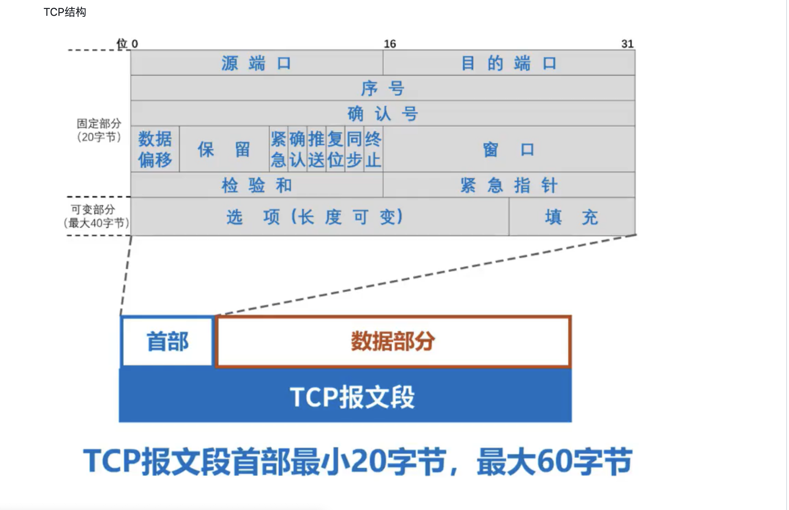
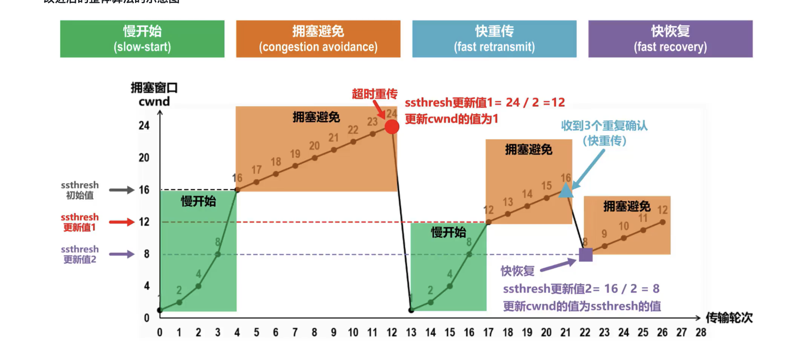
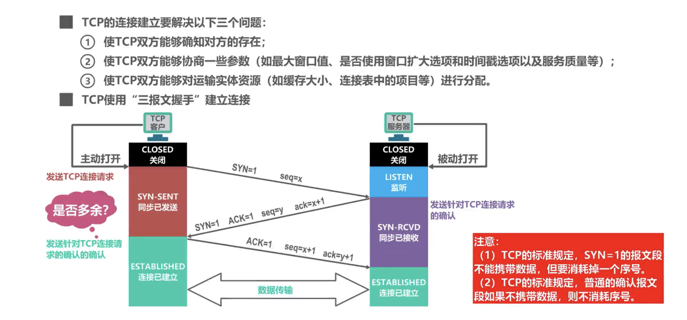
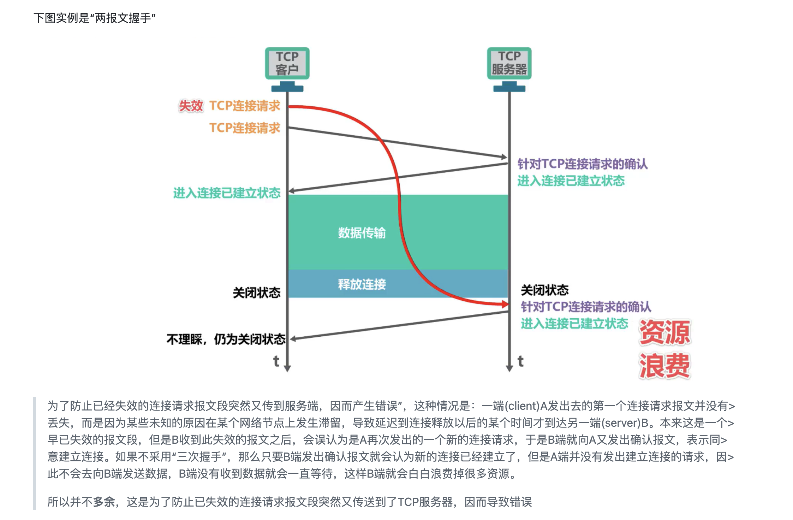
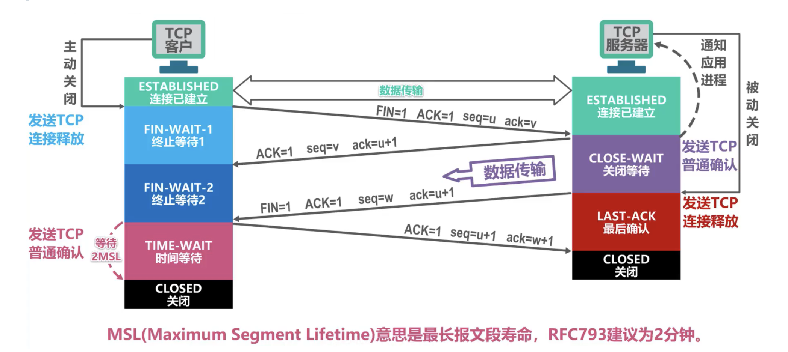

# TCP和UDP

## 1.TCP
- 面向字节流的: 这是他实现可靠传输，流量控制以及拥塞控制的基础
- 仅支持单播，即一对一的传输
- 全双工可靠连接: 不会出现丢失，重复，乱序, 误码
> 针对同一域名最多可以建立 6 个并发的 TCP 连接
> HTTP/2 协议允许在单个 TCP 连接上进行多路复用（multiplexing）
> 因此，HTTP/2 通常只需要一个 TCP 连接来处理同一域名下的所有请求

### 首部

### 可靠传输
1. 确认应答机制
2. 超时重传机制

### 流量控制
**针对双方的缓存空间**
1. 重传计时器超时后，零窗口探测报文段会被重传
2. 探测报文（也有自己的定时重传）

### 拥塞控制 
**针对网络承载能力**

### 三次握手

#### 能否两次握手，最后一次普通确认报文能否省略？
1. 无法确认服务端的发送能力
2. 浪费服务端资源

### 四次挥手

### TCP保活计时器的作用
1. TCP服务器进程每收到一次TCP客户进程的数据，就重新设置并启动保活计时器（2小时定时）。
2. 若保活计时器定时周期内未收到TCP客户进程发来的数据，则当保活计时器到时后，TCP服务器进程就向TCP客户进程发送一个探测报文段，以后则每隔75秒钟发送一次。若一连发送10个探测报文段后仍无TCP客户进程的响应，TCP服务器进程就认为TCP客户进程所在主机出了故障，接着就关闭这个连接。
3. 往往这个时间太久了，我们熟知的很多组件都没有开启 keepalive 特性，而是选择在应用层做心跳机制。

### tcp粘包问题

#### 1. 什么是 TCP 粘包？
**TCP中没有包这个概念，包是应用层的数据包**
在 TCP（传输控制协议）中，数据以字节流的形式进行传输，而不是以消息为单位。
因此，当发送方将多个消息发送到网络时，这些消息可能在网络中被合并成一个更大的数据块到达接收方，这就产生了粘包问题。
1. 发送方原因(Nagle算法（主要作用：减少网络中报文段的数量）)
   1. 只有上一个分组得到确认，才会发送下一个分组
   2. 收集多个小分组，在一个确认到来时一起发送
2. 接收方原因
   1. TCP将接收到的数据包保存在接收缓存里，然后应用程序主动从缓存读取收到的分组
   2. 如果TCP接收数据包到缓存的速度大于应用程序从缓存中读取数据包的速度，多个包就会被缓存
#### 2. 如何解决 TCP 粘包问题？
1. 固定长度消息
2. 分隔符: 特定分隔符法在消息协议足够简单的场景下比较高效，Redis 在通信过程中采用的就是换行分隔符。
3. 长度前缀
4. 应用层协议

#### 3.UDP会不会粘包?
不会,UDP则是面向消息传输的

### 其他问题
#### 1. SYN报文什么情况下会被丟弃？
1. 半连接队列和全连接队列满了
2. 开启 tcp_tw_recycle 参数，并且在 NAT 环境下

#### 2. tcp如何提高传输效率
1. 发送方的发送量（也可以理解为发送速率）滑动窗口
2. 接收方的接收能力（对方是否能承受大的数据量）
   - 流量控制机制：通过接收方的接收能力来控制发送方发送的数据量
   - 延时应答机制：接收方通过延时一小会，想要给发送方回复一个接收能力（更大的窗口大小）
3. 网络的转发能力（网络是否能转发大的数据量）拥塞机制

---

## 2. UDP
- 面向应用报文的
- 支持单播，多播，广播
> UDP协议想要保证可靠，靠的就是程序员在应用层仿照 确认应答和超时重传 就好了

### 首部
四个字段，每个字段 2 字节一共 8 字节
- 源端口
- 目的端口
- 长度
- 检验和