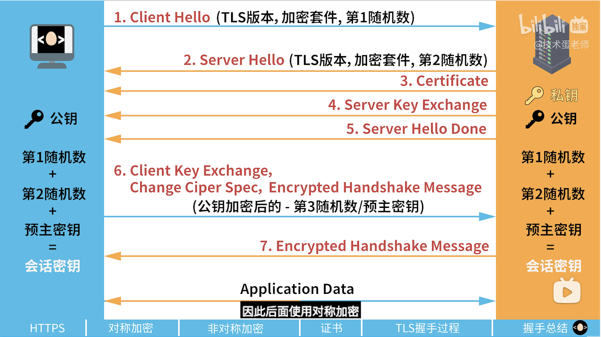

## HTTPS HTTP TLS/SSL
SSL 是 TLS 的前身，现在绝大部分浏览器都不支持 SSL 了

### 一、TLS 1.2 建立流程
- 首先正常三次握手

---

### 二、数字证书
**明文**和**数字签名**共同组成了数字证书，这样一份数字证书就可以颁发给网站了
#### **数字签名**的制作过程：
1. CA机构拥有非对称加密的私钥和公钥。
2. CA机构对证书明文数据T进行hash。
3. 对hash后的值用私钥加密，得到数字签名S。

#### 浏览器验证过程：
1. 拿到证书，得到明文T，签名S。
2. 用**CA机构的公钥**对S解密（由于是浏览器信任的机构，所以浏览器保有它的公钥。），得到S’即 hash。
3. 用证书里指明的hash算法对明文T进行hash得到T’。
4. 显然通过以上步骤，T’应当等于S‘，除非明文或签名被篡改。所以此时比较S’是否等于T’，等于则表明证书可信。

#### 为什么制作数字签名时需要hash一次？
最显然的是性能问题，前面我们已经说了非对称加密效率较差，证书信息一般较长，比较耗时。而hash后得到的是固定长度的信息（比如用md5算法hash后可以得到固定的128位的值），这样加解密就快很多。
当然也有安全上的原因。
---

### 三、TCP+TLS解决的问题包括
- 消息的可靠传输（TCP）
    1. 消息一定送达（送不到我应该会知道）
    2. 消息一定完整（到了一定是完整的）
    3. 消息一定有序（一定以我预期的顺序到达）
- 消息的安全传输（TLS）
    1. **数据加密**-避免窃听（知道你们在聊什么）
    2. 数字签名保证**数据完整性**-避免篡改（就算我不知道你们在聊什么，我也要改动某些信息，让你们沟通产生歧义）
    3. 数字证书实现**身份认证**-避免中间人攻击（不知道你们在聊什么，但是我当传话筒，却传递着假的消息）
    4. 避免**重放攻击**（不知道你们在聊什么，但是我一遍一遍重复某方的话）

### 四、问题

#### 1.在客户端和服务端建立 tls1.2 连接时首先要进行三次握手，之后服务端发送一个响应报文告诉客户端选择的加密套件，再发送一个数据证书，再发送公钥，再发送完成报文？为什么客户端和服务端还没有建立 https 连接，服务端就可以一次推送四个报文？
在 TLS 1.2 中，这些步骤可能会在同一个 TCP 数据包中发送，表面上看起来服务器似乎“连续发送”了多个消息。实际上，这并不是“并行”发送，而是这些消息在协议的设计中可以一起打包发送。
### 如果说这些报文在同一个 TCP 数据包中发送，那为什么每条信息的 seq 不同呢？
- TCP 对传输的每个字节进行编号，这就是 TCP 序列号（Sequence Number）。TCP 序列号并不是为整个消息，而是为每个字节编号的.
- TLS 消息是应用层的数据，TCP 报文段会携带这些 TLS 消息的数据部分。
- 当多个 TLS 消息在同一个 TCP 报文段中传输时，这些消息依次排列，TCP 序列号会继续增长。

#### 2.为什么不直接用第三个随机数（预主秘钥）来作为对称加密的秘钥，还要去和随机数1和2进行计算呢？
不管是客户端还是服务器，都需要随机数，这样生成的密钥才不会每次都一样。由于SSL协议中证书是静态的，因此十分有必要引入一种随机因素来保证协商出来的密钥的随机性。对于RSA密钥交换算法来说，pre-master secret本身就是一个随机数，再加上hello消息中的随机，三个随机数通过一个密钥导出器最终导出一个对称密钥。pre-master secret的存在在于SSL协议不信任每个主机都能产生完全随机的随机数，如果随机数不随机，那么pre-mastersecret就有可能被猜出来，那么仅适用pre-master secret作为密钥就不合适了，因此必须引入新的随机因素，那么客户端和服务器加上pre-master secret三个随机数一同生成的密钥就不容易被猜出了，一个伪随机可能完全不随机，可是是三个伪随机就十分接近随机了，每增加一个自由度，随机性增加的可不是一。

#### 3.服务端和ca加密过程的区别
- 服务端发布公钥，客户端用公钥加密预主密钥，服务端再用私钥解密
- ca 则是用私钥加密明文 hash 过的数字签名，然后客户端可以用公钥来解密

#### 4.当前浏览器没有数字证书中，颁发这个证书的中间 ca 的证书怎么办？
- 有可能网站会发送证书链，没有发要自行从缓存中查找，或去下载中间证书
- 根据证书层测结构，依次查找颁发者
- 找到颁发者后查询自己的电脑里有没有这个办法者的证书，有的话提取公钥验证这个中间证书的签名
- 没问题再用这个证书的公钥验证这个网站的证书的签名

#### 5.每次进行HTTPS请求时都必须在SSL/TLS层进行握手传输密钥吗？
- 初次握手必须进行完整的 TLS 握手
- 当客户端与服务器之前已经建立过 SSL/TLS 会话，且会话没有过期，可以进行**会话恢复**，而不必每次都进行完整的握手。
  - **基于会话 ID** 的恢复：在初次握手时，服务器会为会话分配一个会话 ID，客户端在后续请求中可以使用这个 ID 来请求恢复会话。服务器通过这个 ID 验证并重用之前的加密参数。
  - **基于会话票据**（Session Ticket）的恢复：服务器在初次握手时将会话参数加密后发送给客户端，客户端保存该票据。在后续请求中，客户端发送这个票据，服务器解密并恢复会话参数。

#### 6.非对称加密比对称加密慢的主要原因是其加密和解密过程的复杂性和计算成本较高。以下是一些导致非对称加密速度较慢的主要因素：
1. **密钥长度**：非对称加密算法使用较长的密钥，通常在1024位、2048位或更多位。密钥越长，加密和解密所需的计算量就越大，因此加密速度较慢。相比之下，对称加密算法通常使用较短的密钥，例如128位或256位。
2. **计算复杂性**：非对称加密算法涉及到复杂的数学运算，例如大素数的乘法和取模运算。这些运算需要更多的处理器计算能力和时间，因此导致了加密和解密的速度较慢。对称加密算法通常涉及到的运算更为简单，例如位运算和替代运算，速度更快。
3. **密钥交换**：在非对称加密中，密钥交换通常需要更多的计算步骤。客户端和服务器之间必须执行密钥协商过程，这涉及使用非对称密钥加密和解密数据，然后再转换为对称密钥进行实际的数据传输。这个额外的交互导致了速度降低。
4. **资源需求**：非对称加密通常需要更多的计算资源，包括CPU处理能力和内存。这可能在高负载环境下导致性能下降。

#### 7.使用https绝对安全吗？
1. 用户使用来路不明的浏览器，里边预装的根证书有问题，或者用户忽略 https 证书错误或过期的验证
2. HTTPS 中间人攻击
3. 中间证书链攻击

#### 8.介绍下 HTTPS 中间人攻击

##### 1. **常见的中间人攻击类型**

   **1. 不可信 CA 签发的伪造证书**
   - **原理**：攻击者通过说服或攻击不可信的证书颁发机构（CA）签发伪造的 SSL/TLS 证书。这些证书看似合法，但实际上是伪造的。攻击者将伪造证书插入到客户端与服务器的通信中，使客户端误以为与合法服务器建立了连接。
   - **影响**：用户的通信内容会被攻击者完全解密和篡改。

   **2. 本地网络上的中间人攻击**
   - **原理**：在公共 Wi-Fi 或不安全的局域网中，攻击者可能使用 ARP 欺骗或 **DNS 劫持**等技术，将受害者的流量重定向到攻击者的服务器。然后，攻击者与客户端和服务器分别建立 HTTPS 连接，截获并篡改通信内容。
   - **影响**：攻击者可以在不被察觉的情况下监视和篡改用户的数据。

   **3. SSL 剥离攻击 Stripping**
   - **原理**：攻击者通过拦截用户的 HTTP 请求，将 HTTPS 链接转换为不安全的 HTTP 连接。然后，攻击者与客户端保持 HTTP 连接，并与服务器建立 HTTPS 连接，从而能读取和篡改通信内容。
   - **影响**：用户的通信内容变得不安全，敏感信息可能被泄露。

##### 2. **防御措施**

   **1. 使用 HSTS（HTTP Strict Transport Security）**
   - **作用**：HSTS 是一种安全策略，强制浏览器仅通过 HTTPS 访问站点，并拒绝任何不安全的 HTTP 连接。这可以有效防止 SSL Stripping 攻击。

   **2. 正确配置和使用证书**
   - **作用**：使用受信任的证书颁发机构（CA）签发的 SSL/TLS 证书，并定期更新和管理证书。避免使用自签名证书和过期证书，防止不可信的证书被滥用。

   **3. 使用双因素认证（2FA）**
   - **作用**：即使攻击者能够通过中间人攻击获得用户的凭证，双因素认证仍然可以提供额外的安全层，防止未经授权的访问。

   **4. 验证证书**
   - **作用**：用户应注意浏览器对 HTTPS 连接的安全警告，并确保连接的证书是受信任的。如果出现证书警告，应谨慎处理，避免访问可能不安全的站点。

   **5. 加强 DNS 安全**
   - **作用**：使用 DNSSEC 和安全的 DNS 解析器，以防止 DNS 劫持和其他基于 DNS 的攻击。

##### 3. **攻击示例**
   - **不可信 CA**：2011 年，DigiNotar CA 被黑客攻破，导致其签发了伪造的 SSL 证书。攻击者利用这些证书对用户进行中间人攻击，特别是在伊朗，大量用户的 HTTPS 流量被拦截和监视。
   - **公共 Wi-Fi 中间人攻击**：攻击者在公共 Wi-Fi 热点上执行中间人攻击，拦截用户的 HTTPS 流量，并通过伪造的证书进行通信劫持。

#### 9.什么是中间证书链攻击？
证书链攻击利用了信任链的弱点。攻击者可能会尝试伪造一个数字证书，该证书声称是一个受信任的CA签发的，然后用它来欺骗用户。如果用户不仔细检查证书的真实性，就可能被欺骗相信这个伪造的证书是合法的，从而暴露他们的敏感信息或与攻击者进行通信。

- 滥用中间证书：如果攻击者能够获取或伪造一个受信任的中间证书，他们可以利用这个证书生成新的服务器证书，并伪装成合法的网站。
- 弱验证机制：某些系统或应用程序可能不会严格验证证书链的完整性或有效性，尤其是对于中间证书的来源。攻击者可以利用这点来插入恶意的中间证书。
- 信任滥用：如果中间证书被广泛信任，并且证书链中的验证不充分，那么攻击者可以通过插入恶意中间证书使得最终的服务器证书看起来合法。
