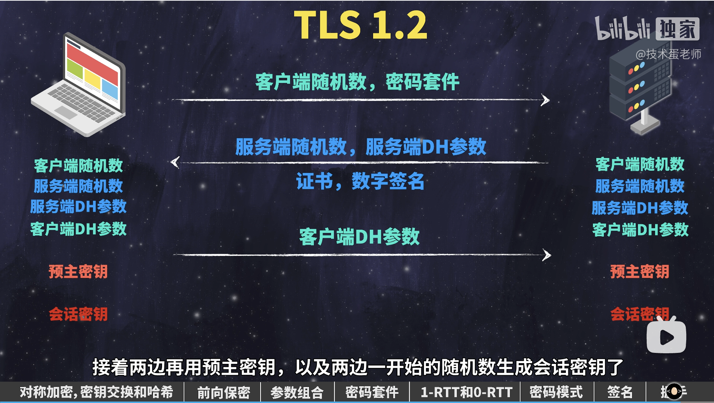

## HTTPS HTTP TLS/SSL
SSL 是 TLS 的前身，现在绝大部分浏览器都不支持 SSL 了

### 一、TLS 1.2 建立流程
- 首先正常三次握手
- 在加密套件中选择对称加密算法、非对称加密算法、MAC算法



---

### 二、数字证书
**明文**和**数字签名**共同组成了数字证书，这样一份数字证书就可以颁发给网站了
#### **数字签名**的制作过程：
1. CA机构拥有非对称加密的私钥和公钥。
2. CA机构对证书明文数据T进行hash。
3. 对hash后的值用私钥加密，得到数字签名S。

#### 浏览器验证过程：
1. 拿到证书，得到明文T，签名S。
2. 用**CA机构的公钥**对S解密（由于是浏览器信任的机构，所以浏览器保有它的公钥。），得到S’即 hash。
3. 用证书里指明的hash算法对明文T进行hash得到T’。
4. 显然通过以上步骤，T’应当等于S‘，除非明文或签名被篡改。所以此时比较S’是否等于T’，等于则表明证书可信。

#### 为什么制作数字签名时需要hash一次？

最显然的是性能问题，前面我们已经说了非对称加密效率较差，证书信息一般较长，比较耗时。而hash后得到的是固定长度的信息（比如用md5算法hash后可以得到固定的128位的值），这样加解密就快很多。
当然也有安全上的原因。

---

### 三、TCP+TLS解决的问题包括
- 消息的可靠传输（TCP）
    1. 消息一定送达（送不到我应该会知道）
    2. 消息一定完整（到了一定是完整的）
    3. 消息一定有序（一定以我预期的顺序到达）
- 消息的安全传输（TLS）
    1. **数据加密**-避免窃听（知道你们在聊什么）
    2. 数字签名保证**数据完整性**-避免篡改（就算我不知道你们在聊什么，我也要改动某些信息，让你们沟通产生歧义）
    3. 数字证书实现**身份认证**-避免中间人攻击（不知道你们在聊什么，但是我当传话筒，却传递着假的消息）
    4. 避免**重放攻击**（不知道你们在聊什么，但是我一遍一遍重复某方的话）


### 四、问题

#### 1.在客户端和服务端建立 tls1.2 连接时首先要进行三次握手，之后服务端发送一个响应报文告诉客户端选择的加密套件，再发送一个数据证书，再发送公钥，再发送完成报文？为什么客户端和服务端还没有建立 https 连接，服务端就可以一次推送四个报文？
在 TLS 1.2 中，这些步骤可能会在同一个 TCP 数据包中发送，表面上看起来服务器似乎“连续发送”了多个消息。实际上，这并不是“并行”发送，而是这些消息在协议的设计中可以一起打包发送。
### 如果说这些报文在同一个 TCP 数据包中发送，那为什么每条信息的 seq 不同呢？
- TCP 对传输的每个字节进行编号，这就是 TCP 序列号（Sequence Number）。TCP 序列号并不是为整个消息，而是为每个字节编号的.
- TLS 消息是应用层的数据，TCP 报文段会携带这些 TLS 消息的数据部分。
- 当多个 TLS 消息在同一个 TCP 报文段中传输时，这些消息依次排列，TCP 序列号会继续增长。

#### 2.为什么不直接用第三个随机数（预主秘钥）来作为对称加密的秘钥，还要去和随机数1和2进行计算呢？
不管是客户端还是服务器，都需要随机数，这样生成的密钥才不会每次都一样。由于SSL协议中证书是静态的，因此十分有必要引入一种随机因素来保证协商出来的密钥的随机性。对于RSA密钥交换算法来说，pre-master secret本身就是一个随机数，再加上hello消息中的随机，三个随机数通过一个密钥导出器最终导出一个对称密钥。pre-master secret的存在在于SSL协议不信任每个主机都能产生完全随机的随机数，如果随机数不随机，那么pre-mastersecret就有可能被猜出来，那么仅适用pre-master secret作为密钥就不合适了，因此必须引入新的随机因素，那么客户端和服务器加上pre-master secret三个随机数一同生成的密钥就不容易被猜出了，一个伪随机可能完全不随机，可是是三个伪随机就十分接近随机了，每增加一个自由度，随机性增加的可不是一。

#### 3.服务端和ca加密过程的区别
- 服务端发布公钥，客户端用公钥加密预主密钥，服务端再用私钥解密
- ca 则是用私钥加密明文 hash 过的数字签名，然后客户端可以用公钥来解密

#### 4.当前浏览器没有数字证书中，颁发这个证书的中间 ca 的证书怎么办？
- 该证书通常会包含一个证书链。这个链通常包括：
   - 服务器证书
   - 中间 CA 证书（如果有）
   - 根 CA 证书（受信任的根证书）
  
当客户端进行 HTTPS 连接时，如果客户端的根证书中没有包含服务器数字证书的颁发机构（即该 CA 机构的根证书），客户端将无法直接验证该服务器证书的可靠性。这时客户端通常有以下几种处理方式：
##### 1. **证书链（Intermediate CA）验证**
通常，服务器会提供一条完整的证书链，其中包含了服务器的数字证书以及中间证书。中间证书是由更高级别的 CA 机构签发的，直到链条的顶端是受信任的根证书。如果客户端的根证书存储中包含这条链顶端的根证书，客户端就能通过这条证书链验证服务器证书的可靠性。

**过程**：
- 客户端首先检查服务器证书的直接签发者是否有一个与其对应的中间 CA 证书。
- 如果找到，则继续沿着证书链向上查找。
- 最终，客户端尝试在其根证书存储中找到对应的根 CA 证书。
- 如果找到，验证通过；如果找不到，验证失败。

##### 2. **动态下载中间证书**
如果证书链中的某个中间证书客户端没有，现代浏览器和操作系统有能力从证书的颁发机构（CA）的 URL 自动下载缺失的中间证书，从而完成证书链的验证。

**过程**：
- 当客户端收到服务器证书时，它可以检查证书中是否包含指向中间 CA 证书的 URL（通常在证书的 `Authority Information Access` 字段中）。
- 如果找到，客户端会尝试下载该中间 CA 证书。
- 下载成功后，客户端可以继续验证证书链。

##### 3. **用户手动信任**
如果自动方法失败或不可行，用户可能会收到警告，提示证书不被信任。这时，用户可以手动选择信任该证书的签发机构，添加其根证书到本地证书存储中。

**过程**：
- 浏览器会显示一个安全警告，告知用户该证书不受信任。
- 用户可以选择查看详细信息并手动将该证书或证书链中的某个证书标记为信任。

##### 4. **证书吊销检查**
在某些情况下，即使证书链是完整的，客户端还会通过在线检查证书吊销列表（CRL）或在线证书状态协议（OCSP）来确保证书没有被吊销。这些检查由证书本身或证书链中的中间 CA 提供的信息触发。

#### 5.每次进行HTTPS请求时都必须在SSL/TLS层进行握手传输密钥吗？
- 初次握手必须进行完整的 TLS 握手
- 当客户端与服务器之前已经建立过 SSL/TLS 会话，且会话没有过期，可以进行**会话恢复**，而不必每次都进行完整的握手。
  - **基于会话 ID** 的恢复：在初次握手时，服务器会为会话分配一个会话 ID，客户端在后续请求中可以使用这个 ID 来请求恢复会话。服务器通过这个 ID 验证并**重用之前的加密参数**。
  - **基于会话票据**（Session Ticket）的恢复：服务器在初次握手时将会话参数加密后发送给客户端，客户端保存该票据。在后续请求中，客户端发送这个票据，服务器解密并恢复会话参数。

#### 6.非对称加密比对称加密慢的主要原因是其加密和解密过程的复杂性和计算成本较高。以下是一些导致非对称加密速度较慢的主要因素：
1. **密钥长度**：非对称加密算法使用较长的密钥，通常在1024位、2048位或更多位。密钥越长，加密和解密所需的计算量就越大，因此加密速度较慢。相比之下，对称加密算法通常使用较短的密钥，例如128位或256位。
2. **计算复杂性**：非对称加密算法涉及到复杂的数学运算，例如大素数的乘法和取模运算。这些运算需要更多的处理器计算能力和时间，因此导致了加密和解密的速度较慢。对称加密算法通常涉及到的运算更为简单，例如位运算和替代运算，速度更快。
3. **密钥交换**：在非对称加密中，密钥交换通常需要更多的计算步骤。客户端和服务器之间必须执行密钥协商过程，这涉及使用非对称密钥加密和解密数据，然后再转换为对称密钥进行实际的数据传输。这个额外的交互导致了速度降低。
4. **资源需求**：非对称加密通常需要更多的计算资源，包括CPU处理能力和内存。这可能在高负载环境下导致性能下降。

#### 7.使用https绝对安全吗？
1. 用户使用来路不明的浏览器，里边预装的根证书有问题，或者用户忽略 https 证书错误或过期的验证
2. HTTPS 中间人攻击
3. 中间证书链攻击
4. dns 劫持

#### 8.介绍下 HTTPS 中间人攻击

##### 1. **常见的中间人攻击类型**

   **1. 不可信 CA 签发的伪造证书**
   - **原理**：攻击者通过说服或攻击不可信的证书颁发机构（CA）签发伪造的 SSL/TLS 证书。这些证书看似合法，但实际上是伪造的。攻击者将伪造证书插入到客户端与服务器的通信中，使客户端误以为与合法服务器建立了连接。
   - **影响**：用户的通信内容会被攻击者完全解密和篡改。

   **2. 本地网络上的中间人攻击**
   - **原理**：在公共 Wi-Fi 或不安全的局域网中，攻击者可能使用 ARP 欺骗或 **DNS 劫持**等技术，将受害者的流量重定向到攻击者的服务器。然后，攻击者与客户端和服务器分别建立 HTTPS 连接，截获并篡改通信内容。
   - **影响**：攻击者可以在不被察觉的情况下监视和篡改用户的数据。

   **3. SSL 剥离攻击 Stripping**
   - **原理**：攻击者通过拦截用户的 HTTP 请求，将 HTTPS 链接转换为不安全的 HTTP 连接。然后，攻击者与客户端保持 HTTP 连接，并与服务器建立 HTTPS 连接，从而能读取和篡改通信内容。
   - （用户手动使用 http 访问，网站会使用 302 重定向到 https，增加了 rtt，也增加了风险）
   - **影响**：用户的通信内容变得不安全，敏感信息可能被泄露。

##### 2. **防御措施**

   **1. 使用 HSTS（HTTP Strict Transport Security）**
   - **作用**：HSTS 是一种安全策略，强制浏览器仅通过 HTTPS 访问站点，并拒绝任何不安全的 HTTP 连接。这可以有效防止 SSL Stripping 攻击。

   **2. 正确配置和使用证书**
   - **作用**：使用受信任的证书颁发机构（CA）签发的 SSL/TLS 证书，并定期更新和管理证书。避免使用自签名证书和过期证书，防止不可信的证书被滥用。

   **3. 使用双因素认证（2FA）**
   - **作用**：即使攻击者能够通过中间人攻击获得用户的凭证，双因素认证仍然可以提供额外的安全层，防止未经授权的访问。

   **4. 验证证书**
   - **作用**：用户应注意浏览器对 HTTPS 连接的安全警告，并确保连接的证书是受信任的。如果出现证书警告，应谨慎处理，避免访问可能不安全的站点。

   **5. 加强 DNS 安全**
   - **作用**：使用 DNSSEC 和安全的 DNS 解析器，以防止 DNS 劫持和其他基于 DNS 的攻击。

##### 3. **攻击示例**
   - **不可信 CA**：2011 年，DigiNotar CA 被黑客攻破，导致其签发了伪造的 SSL 证书。攻击者利用这些证书对用户进行中间人攻击，特别是在伊朗，大量用户的 HTTPS 流量被拦截和监视。
   - **公共 Wi-Fi 中间人攻击**：攻击者在公共 Wi-Fi 热点上执行中间人攻击，拦截用户的 HTTPS 流量，并通过伪造的证书进行通信劫持。

#### 9.什么是中间证书链攻击？
1. **伪造中间证书**：攻击者可能会利用弱点或漏洞获取到某个中间证书颁发机构的私钥，或伪造一个中间证书。这使得他们能够伪造合法的网站证书，因为大部分客户端会信任该中间证书。如果这个伪造的中间证书被成功注入到一个用户的系统中，那么用户在访问任何网站时，攻击者都可以通过伪造证书来拦截或篡改通信。

2. **滥用已被授权的中间证书**：有时合法的中间证书会被不当使用，或被授权给不受信任的实体。这些实体可能滥用它们的签发权限，来生成恶意的服务器证书，从而冒充合法的受信任网站。

#### 10.重放攻击
##### 1.一个 tcp连接里重放 http 的攻击
[序号示例](https://baijiahao.baidu.com/s?id=1710285194967020418&wfr=spider&for=pc)
而TCP协议是一个面向连接的协议，在一个TCP协议中可以发起多次http通信。因此出现了一种攻击方式——中间人通过监听一次TCP连接中的http请求，然后重放这些http请求，达成重放攻击。当然不只是重放，还可以对这些http请求进行重新排序再发放。
##### MAC 防止重放攻击
- **消息序列号**：每个消息或数据包都有一个序列号，这个序列号是唯一的且逐步递增。MAC 算法会将序列号包含在生成 MAC 值的过程中。
- **时间戳**：在某些情况下，时间戳也会被包含在 MAC 计算中，确保数据在特定时间段内有效。这样，即使数据被重放，时间戳会失效，导致 MAC 校验失败。
- **验证顺序**：服务器使用 MAC 校验值来确保消息的顺序和完整性。如果接收到的消息的序列号不是递增的，或者 MAC 校验值不匹配，服务器会拒绝该消息，防止重放攻击。
- **TLS 会话重新协商**：在一些情况下，特别是在长时间连接中，客户端和服务器会重新协商新的密钥和 MAC 密钥，以防止会话密钥被攻击者破解后用于重放攻击。

##### 实际过程
1. 数据发送：
   - 客户端或服务器使用密钥和 MAC 算法对消息内容以及序列号生成 MAC。
   - 生成的 MAC 附加到消息后一起发送。
2. 数据接收：
   - 接收方使用相同的密钥和 MAC 算法重新计算收到的消息和序列号的 MAC。
   - 将计算出的 MAC 与附加在消息中的 MAC 进行比较。
   - 如果 MAC 匹配，且序列号按顺序递增，消息通过验证；否则，消息会被拒绝。
##### 2.重放整个tcp连接的攻击
既然你不让我以（0 0 1 1 2 2）的形式进行重放攻击，那么我按（0 1 2）（0 1 2）进行重放攻击，又如何？
事实上完全可以，而不重数就是为了解决这个问题而诞生的。不重数由客户端和服务器各自生成的不重数拼接而成。并通过不重数的参与来生成主密钥（Master Secret）。由此避免了多次重放攻击。

#### 11. 分割报文问题
- 分割报文发生在（双方使用主密钥（Master Secret）对消息进行对称加密，并传输消息），传输消息的过程中。
- 由于我们对数据进行了加密，所以另一端需要对数据进行解密。如果一个报文（比如http响应）特别大，那么另一端就需要在获得完整报文之后才可以对数据进行解密。这带来了不可忽视的性能问题。
- TLS的解决方案是，TLS再对报文做了分割，分割成了多个记录。以记录为单位发送数据。
- 回顾我们在MAC算法中提到的序列号，事实上，这个序列号不是http报文的序列号，而是记录的序列号。

####  12.每次进行HTTPS请求时都必须在SSL/TLS层进行握手传输密钥吗？
- SSL/TLS中的session跟HTTP的session类似，都是用来保存客户端和服务端之间交互的一些记录，这里的SSL的session保存的是SSL的握手记录。
- 不需要每次进行 HTTPS 请求时都重新在 SSL/TLS 层进行完整的握手传输密钥。具体来说，SSL/TLS 握手主要分为以下两种情况：
##### **会话恢复（Session Resumption）**
   - **情况**：当客户端与服务器之前已经建立过 SSL/TLS 会话，且会话没有过期，可以进行会话恢复，而不必每次都进行完整的握手。
   - **过程**：
     - **基于会话 ID 的恢复**：在初次握手时，服务器会为会话分配一个会话 ID，客户端在后续请求中可以使用这个 ID 来请求恢复会话。服务器通过这个 ID 验证并重用之前的加密参数。（负载均衡多机不好同步，不好控制失效时间）
     - **基于会话票据（Session Ticket）的恢复**：服务器在初次握手时将会话参数加密后发送给客户端，客户端保存该票据。在后续请求中，客户端发送这个票据，服务器解密并恢复会话参数。（只有服务端能加密解密，存在客户端，下次带过来就好，所有客户端都使用这一个密钥，增加了风险，所以服务端要定期统一更换密钥）
   - **特点**：速度快，减少了握手所需的往返次数，并重用了之前生成的加密密钥，从而减少延迟和计算开销。

基于以上原因 TLS1.3 （http3.0）取消了上边两种机制，取而代之的是 PSK，即各个客户端不会使用同一个密钥，是握手阶段协商出来的

#### 13.tls握手阶段会使用随机数来参与生成主密钥，由于主密钥由随机数参与生成所以可以避免整个 tcp 连接重放的攻击，但是如果我使用Session ID来恢复连接，那我的主密钥与之前相同，服务器会不会认为这个一个整段 tcp 重放的攻击？
- **新的握手过程**：即使使用 Session ID 恢复连接，客户端和服务器依然需要进行一次新的握手。在这个握手过程中，双方会生成新的随机数，这些随机数会与之前的主密钥组合生成新的会话密钥（session keys）。因此，尽管主密钥相同，但每次恢复会话时，实际用于加密的会话密钥是不同的。
- **唯一的消息序列号**：在 TLS 会话中，每个记录（即消息或数据包）都有一个唯一的序列号。即便恢复会话，序列号也会重新初始化并从零开始。这确保了新会话中的数据包与之前会话中的数据包序列号不同，防止重放攻击。
- **MAC（消息认证码）**：如前所述，TLS 会对每个消息计算 MAC，其中包含了序列号和会话密钥。即便攻击者截获并重放了之前的消息，由于序列号和会话密钥的不同，MAC 校验将会失败，服务器会拒绝该消息。

#### 14.tls1.3 如何使用 0RTT恢复会话？有被重放攻击的风险吗？
在 TLS 1.3 中，0-RTT（Zero Round-Trip Time Resumption）是一种优化机制，旨在通过允许客户端在握手的第一个消息中发送数据，从而加速会话恢复。这种机制在恢复之前的会话时，可以减少延迟，但也带来了一些安全风险，特别是重放攻击的风险。

##### TLS 1.3 中的 0-RTT 恢复会话

1. **0-RTT 简介**：
   - 在传统的 TLS 握手中，客户端和服务器必须经过至少一个往返时间（RTT）才能建立安全连接，并在此之后才能传输应用数据。
   - 在 0-RTT 模式下，客户端可以利用之前的会话密钥和加密参数，立即发送应用数据，从而减少延迟。

2. **0-RTT 恢复会话的流程**：
   - **客户端缓存会话信息**：在初次握手时，服务器会发送一个会话票据（Session Ticket）给客户端。客户端可以将其缓存，以便在将来恢复会话时使用。
   - **客户端发送 0-RTT 数据**：当客户端再次与服务器建立连接时，它可以发送一个包含上次会话票据的客户端Hello消息（ClientHello），并附带要发送的0-RTT数据。
   - **服务器验证**：服务器收到客户端的0-RTT数据后，可以选择接受、拒绝或延迟处理这些数据。如果服务器认为0-RTT数据有效且安全，则会继续处理；否则可以忽略或丢弃这些数据。

##### 0-RTT 的安全性问题

1. **重放攻击的风险**：
   - **重放攻击**：由于0-RTT数据是在握手完成之前发送的，并且它使用的是之前会话的密钥，可能会被攻击者截获并重新发送给服务器。这种攻击被称为重放攻击。
   - **风险来源**：0-RTT数据是不可逆的，并且使用的是早先生成的密钥，因此它不能完全保证其数据的唯一性和安全性。

2. **缓解重放攻击的措施**：
   - **服务器端防御**：服务器可以通过记录并识别已处理的0-RTT数据来防止重放攻击。例如，服务器可以跟踪之前的会话票据和时间戳，拒绝重复的数据。
   - **数据幂等性**：客户端应尽量确保发送的0-RTT数据是幂等的（即重复处理不会产生不同的结果）。这样，即使数据被重放，也不会对服务器造成不同的影响。
   - **降低敏感数据的发送**：避免在0-RTT阶段发送敏感或不可逆的数据，例如交易请求或状态更改。

##### 总结

TLS 1.3 的0-RTT机制可以显著减少延迟，提高网络性能，但也引入了重放攻击的风险。为了应对这些风险，服务器和客户端需要采取适当的措施，例如记录0-RTT数据的使用情况，以及确保0-RTT数据的幂等性。TLS 1.3虽然通过加密和验证机制增强了整体的安全性，但在使用0-RTT时，必须权衡性能和安全性之间的平衡。
#### 14. 介绍下 HSTS
HTTP Strict Transport Security (HSTS) 是一种 Web 安全策略机制，它通过强制客户端（如浏览器）与服务器之间始终使用 HTTPS 连接，来防止协议降级攻击和 cookie 劫持等网络攻击。

##### HSTS 的工作原理

1. **响应头的配置**：
   当服务器启用了 HSTS，它会在响应中包含一个 `Strict-Transport-Security` 头。这个头部通知客户端该站点必须通过 HTTPS 访问，而不能通过 HTTP。

   ```http
   Strict-Transport-Security: max-age=31536000; includeSubDomains; preload
   ```

   这个头部包含以下指令：
   - `max-age`：指定 HSTS 规则的有效期（以秒为单位）。在这个时间段内，客户端将强制通过 HTTPS 访问该站点。
   - `includeSubDomains`（可选）：如果设置此选项，客户端也将强制通过 HTTPS 访问所有子域名。
   - `preload`（可选）：如果设置了 `preload`，站点可以被列入浏览器的 HSTS 预加载列表中。这个列表会内置在浏览器中，即使第一次访问站点时还未收到 HSTS 响应头，也会强制使用 HTTPS 连接。

2. **客户端行为**：
   - **首次访问**：当客户端首次通过 HTTPS 访问一个启用了 HSTS 的站点，并收到包含 `Strict-Transport-Security` 头的响应后，浏览器会将该规则缓存下来。
   - **后续访问**：在有效期内，浏览器会自动将所有对该站点的 HTTP 请求重定向为 HTTPS 请求，即使用户手动输入了 `http://` 的 URL。
   - **强制安全**：即使攻击者试图通过中间人攻击等方式迫使客户端使用 HTTP，HSTS 也会阻止这种行为，从而保护通信的机密性和完整性。

3. **防止协议降级攻击**：
   - **协议降级攻击**：在传统的 HTTPS 实现中，攻击者可能试图通过伪造的 HTTP 响应来降级 HTTPS 连接（例如，通过中间人攻击）。HSTS 阻止了这种攻击，因为一旦 HSTS 生效，浏览器会拒绝与该站点进行非 HTTPS 连接。

4. **预加载列表**：
   - **预加载机制**：某些站点可以申请加入浏览器的 HSTS 预加载列表。这个列表由各大浏览器维护，并在浏览器发行版中内置。当用户首次访问一个在该列表中的站点时，浏览器已经知道要强制使用 HTTPS。

##### HSTS 的优势

- **提高安全性**：通过强制 HTTPS 连接，HSTS 有效防止了网络攻击者通过中间人攻击或协议降级攻击来窃取或篡改数据。
- **自动重定向**：浏览器会自动将 HTTP 请求重定向到 HTTPS，无需服务器再次发送重定向响应。
- **保护敏感信息**：HSTS 能够防止敏感信息（如认证 Cookie）通过不安全的 HTTP 连接泄露。

##### 注意事项

- **首次访问的安全性**：HSTS 只能在客户端首次通过 HTTPS 访问站点后生效。如果首次访问通过 HTTP，则仍有可能受到中间人攻击。预加载列表可以在一定程度上缓解这一问题。
- **配置正确**：如果启用了 HSTS，必须确保 HTTPS 配置正确且证书有效。如果 HTTPS 证书过期或无效，用户将无法访问站点，除非删除浏览器中的 HSTS 规则。

### 五、TLS1.2和TLS1.3

#### TLS1.2的加密算法
1. RSA：服务器用公钥加密，私钥解密，但密钥是静态的，被破解就完了，如果以前的通信被保存，都会被解析出来
2. DH：用随机数和各自的私钥生成同一个密钥，如果被破解了，也可能只是一次通信中的一小段报文。但如不使用临时随机数，或者静态随机数，还是有问题。DH 算法使用的数字越大，被逆推的难度就越大

他们的共同问题都是公钥和私钥都是静态的

#### TLS1.3

#### 1.废弃 DH 算法中很多弱的参数组合
- TLS1.2是支持降级的，客户端与服务端进行首次 tls 握手时是明文的，如果中间人劫持，与服务端建立联系，可以主动让服务端降级。
- 如果服务端选用了降级的 512bit 参数，被破解就容易多了。
- 所以 TLS1.3废弃了 DH 算法中很多弱的参数组合

#### 2.密码套件
- TLS1.2 有 30 多套密码套件
- TLS 建议支持 5 种密码套件
- 支持的参数少了，TLS1.3 就可以一开始就发送协商参数。TLS1.2 时，client hello 时首次需要协商参数，需要服务端发回参数，客户端再发送协商参数。现在客户端首次随着 client hello 发送参数，服务端直接返回协商参数
- 减少到了 1RTT
- 恢复会话时，上次协商的密钥加上Session Ticket，0RTT 恢复

#### 3.为什么 TLS1.3 比 TLS1.2 减少了握手次数？
TLS 1.3 比 TLS 1.2 减少了握手次数，主要是因为它优化了加密握手过程，具体来说是减少了从客户端和服务器建立连接到加密通信的步骤。这些优化提升了性能，尤其是在延迟敏感的场景中。

##### TLS 1.2 握手过程
在 TLS 1.2 中，典型的握手过程如下：

1. **客户端Hello**：客户端发送支持的协议版本、加密套件和随机数。
2. **服务器Hello**：服务器选择加密套件，发送自己的证书和随机数，并可能要求客户端提供客户端证书（在需要时）。
3. **密钥交换**：双方协商生成对称密钥，这通常涉及 Diffie-Hellman (DHE) 或 RSA 方式。客户端生成预主密钥，使用服务器的公钥加密并发送给服务器。
4. **证书验证**：服务器验证客户端证书（如果需要），然后客户端和服务器各自生成主密钥。
5. **握手完成**：双方使用生成的对称密钥对后续通信进行加密。

在这整个过程中，需要经过两轮完整的消息往返（RTT, Round Trip Time），才能完成密钥交换并开始加密通信。

##### TLS 1.3 优化了握手过程
TLS 1.3 通过简化密钥交换过程，减少了需要的往返次数：

1. **客户端Hello**：客户端发送支持的协议版本、加密套件、随机数，以及预共享密钥（PSK）或 Diffie-Hellman 公钥（用于生成共享密钥）。此时，客户端已经发送了它的密钥交换信息。
2. **服务器Hello**：服务器选择加密套件，发送自己的证书和随机数，同时发送自己的 Diffie-Hellman 公钥，并生成对称密钥。

在 TLS 1.3 中，上述步骤可以在一轮消息往返中完成，这意味着客户端和服务器可以在一个往返之后立即进行加密通信。

##### 0-RTT 数据
TLS 1.3 引入了 **0-RTT (Zero Round Trip Time) 数据** 功能，这允许客户端在重新建立连接时，使用之前的会话密钥进行加密，立即发送数据，而无需等待服务器响应。虽然 0-RTT 数据带来了一些重放攻击的风险，但它显著减少了握手时间。

##### 减少握手次数的原因
- **减少了密钥交换的消息**：TLS 1.3 将密钥交换信息包括在初始的 ClientHello 消息中，避免了像 TLS 1.2 那样需要额外的往返。
- **简化了加密套件**：TLS 1.3 移除了不安全的加密算法和复杂的加密选项，使得协议更简洁和高效。
- **引入 0-RTT**：在某些情况下，允许客户端在没有完整握手的情况下立即发送加密数据。

##### 总结
TLS 1.3 通过将密钥交换信息移入客户端初始消息，减少了握手过程中所需的往返次数，并通过 0-RTT 提供了进一步的性能优化，这些改进使得 TLS 1.3 在连接速度和安全性上都优于 TLS 1.2。


