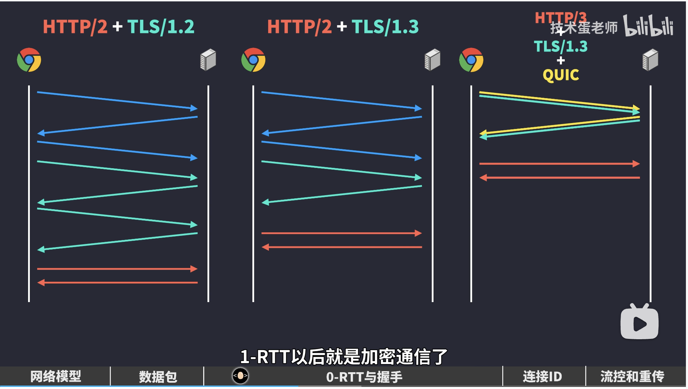

## http3.0 2018年 quic 更名为 http3
[http3.0](https://zhuanlan.zhihu.com/p/330300133)

http1.0

HTTP/1.1 vs HTTP/2 响应

HTTP/2 多路复用响应

HTTP/2 和 TCP 在透视图上的差异

HTTP/1.1 vs HTTP/2 vs HTTP/3

TCP 和 QUIC 在透视图上的差异

- UDP上的 QUIC协议，相当于整合了TCP和 TLS
- http3 的应用层上没有所谓的帧的概念，把数据帧移到了传输层里，数据帧再封装成数据包
- 数据包在帧上又加了些信息，**connection ID**，网络发生变化，即使 ip 发生改变，但是客户端和服务端协商好了连接 ID，可以识别为同一个连接，避免再次握手
- quic 帧的内容被 tls 加密了 ，quic 数据包被 udp 分装成数据段  
- 目前 quic 其实是在应用层实现的，虽然定义为传输层协议，但目前需要依托 udp 才能实现端到端的连接，这样可以使得 quic 快速部署，而不用等到操作系统全面升级

>关键第一次握手实际上是得到server config的过程。这个config理应是保存很长时间的，所以大多数quic通信是不需要握手的。如果我的config过期了，或者根本没有，server会返回拒绝包，里面附上新的config。所以理论上所有的quic都是0rtt的，只不过有的被拒绝了。

### 优势
1. **QUIC 对其用户更安全。**：没有办法运行明文 QUIC，因此攻击者和窃听者监听的选项也更少。
2. **QUIC 的连接建立速度更快。**：对于 TLS-over-TCP，两种协议都需要自己单独的握手，而 QUIC 将传输和加密握手合二为一。
3. **QUIC 可以更容易地进化。**：因为它是完全加密的，网络中的中间件不能再像使用 TCP 那样观察和解释其内部工作原理。因此，它们也不会因为更新失败而在较新版本的 QUIC 中（意外地）中断。如果我们想在未来为 QUIC 添加新功能，我们“只需要”更新终端设备，而不是所有的中间件。
4. **连接可以保持更长时间**：四元组：客户端 IP 地址 + 客户端端口 + 服务器 IP 地址 + 服务器端口。在 TCP 中，连接仅由 4 元组标识。因此，如果这四个参数中只有一个发生变化，连接就会失效，需要重新建立（包括新的握手）。
QUIC 引入了一个名为连接标识符 (CID) 的新概念。每个连接都在 4 元组的顶部分配了另一个编号，用于在两个端点之间唯一标识它。
至关重要的是，因为这个 CID 是在 QUIC 本身的传输层定义的，所以在网络之间移动时它不会改变！这如下图所示。为了使这成为可能，CID 包含在每个 QUIC 数据包的前面（很像 IP 地址和端口也存在于每个数据包中）。（它实际上是 QUIC 数据包标头中为数不多的未加密的内容之一！）

### 缺点
1. **许多网络会犹豫是否允许 QUIC。**：公司可能希望在他们的防火墙上阻止它，因为检测不需要的流量变得更加困难。ISP 和中间网络可能会阻止它，因为不再容易获得诸如平均延迟和丢包率之类的指标，从而使检测和诊断问题变得更加困难。这一切都意味着 QUIC 可能永远不会普遍可用
2. **QUIC 具有更高的加密开销。**：QUIC 使用 TLS 加密每个单独的数据包，而 TLS-over-TCP 可以同时加密多个数据包。对于高吞吐量场景，这可能会使 QUIC 变慢
3. 与 TCP 不同，QUIC 不能完全保证**首先发送的数据也会首先被接收**。

- 与 HTTP/2 的数据帧（DATA frames）非常相似，QUIC 的流帧（STREAM frames）分别跟踪每个流的字节范围。这与 TCP 不同，TCP 只是将所有流数据附加到一个大 blob 中。像以前一样，让我们考虑一下如果 QUIC 数据包2丢失，而 1 和 3 到达会发生什么。与 TCP 类似，数据包1中流1（stream 1）的数据可以直接传递到浏览器。然而，对于数据包3，QUIC 可以比 TCP 更聪明。它查看流1的字节范围，发现这个流帧（STREAM frame）完全遵循流id 1的第一个流帧 STREAM frame（字节 450 跟在字节 449 之后，因此数据中没有字节间隙）。它可以立即将这些数据提供给浏览器进行处理。然而，对于流id 2，QUIC确实看到了一个缺口（它还没有接收到字节0-299，这些字节在丢失的 QUIC 数据包2中）。它将保存该流帧（STREAM frame），直到 QUIC 数据包2的重传（retransmission）到达。再次将其与 TCP 进行对比，后者也将数据流1的数据保留在数据包3中！
- 不过，这种方式有几个重要的后果。最有影响的是 QUIC 数据可能不再以与发送时完全相同的顺序发送到浏览器。对于 TCP，如果您发送数据包1、2和3，它们的内容将以完全相同的顺序发送到浏览器（这就是导致队头阻塞的第一个原因）。然而，对于 QUIC，在上面的第二个示例中，在数据包1丢失的情况下，浏览器首先看到数据包2的内容，然后是数据包3的最后一部分，然后是数据包1的（重传），然后是数据包3的第一部分。换言之：QUIC 在单个资源流中保留了顺序，但不再跨单个流（individual streams）进行排序。与 TCP 不同，QUIC 不能完全保证首先发送的数据也会首先被接收。
- 大多数 QUIC 实现很少同时创建包含来自多个流（streams）的数据包（packets）。如果其中一个数据包丢失，则会立即导致单个数据包中所有流的队头阻塞！

### 问题

#### 对于最佳性能，我们有两个相互冲突的性能优化建议：
1. 从 QUIC 的队头阻塞移除中获利：多路复用发送资源（12121212）
2. 为了确保浏览器能够尽快处理核心资源：按顺序发送资源（11112222）

#### 多路复用是否重要？
- 通常建议以顺序方式而不是多路传输方式发送大多数网页资源。换一种说法，如果你有两个文件，你通常最好发送 11112222 而不是 12121212。对于需要在应用之前完全接收的资源，如 JS、CSS 和字体，尤其如此。

- 如果是这样的话，我们可能会想为什么我们需要多路复用？通过扩展：HTTP/2 甚至 HTTP/3，因为多路复用是 HTTP/1.1 没有的主要特性之一。
  1. 首先，一些可以增量处理/呈现的文件确实从多路复用中获益。例如，渐进式图像就是这样。
  2. 第二，如上所述，如果其中一个文件比其他文件小得多，那么它可能会很有用，因为它将更早地下载，而不会对其他文件造成太多的延迟。
  3. 第三，多路复用允许改变响应的顺序，并为高优先级的响应中断低优先级的响应。

- 现实中出现的一个很好的例子是在源服务器前面使用 CDN 缓存。假设浏览器从 CDN 请求两个文件。第一个（1）没有被缓存，需要从源文件中获取，这需要一段时间。第二个资源（2）缓存在 CDN 中，因此可以直接传输回浏览器。
在一个连接上使用 HTTP/1.1，由于队头阻塞，我们必须等待队头完全发送（1），然后才能开始发送（2）。这将给我们带来 11112222，但需要很长的前期等待时间。然而，使用HTTP/2，我们可以立即开始发送（2），利用 CDN 和源节点之间的“思考时间”，并“预热”连接的拥塞控制器。重要的是，如果（1）在（2）完成之前开始到达，我们现在可以简单地开始将（1）的数据注入到响应流中。这样我们就可以得到 22111122，等待的时间要短得多。甚至可以在连接开始时使用服务器推送（Server Push）或103早期提示（103 early hints）等功能。

因此，虽然像 12121212 这样的完全“轮询”多路复用很少是您想要的 Web 性能，但是多路复用在总体上绝对是一个有用的特性。