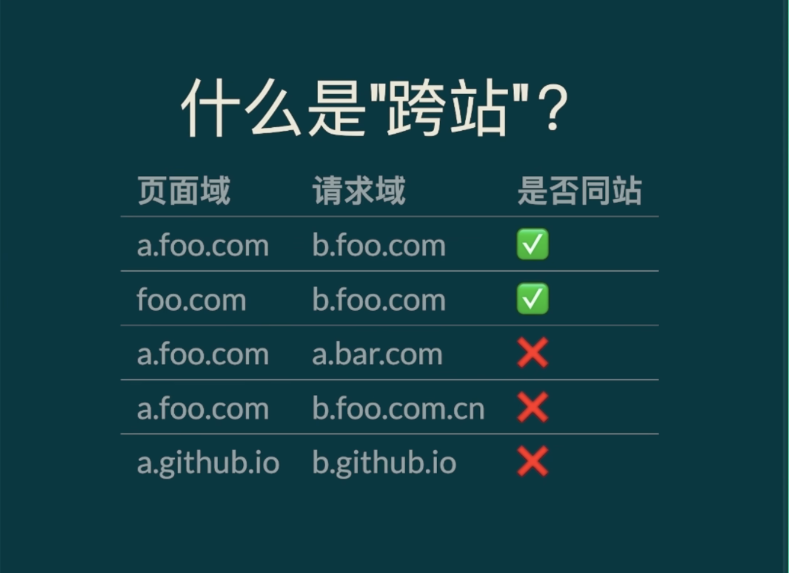

## 一、cookie
### 为什么要使用Cookie？
HTTP最大的特点是无连接无状态，使用Cookie和Session的技术就是为了解决这个问题，简单来说，就是让浏览器在一段时间内认识你。

## 基本信息
- Cookie 是 Web 开发中用于存储和传递小块数据的关键机制，通常用于在客户端和服务器之间保持状态信息。它是 HTTP 协议的一部分，主要用于跟踪用户会话、存储用户偏好或进行身份验证等任务。
- 前端可以通过`document.cookie`来访问cookie。
- Cookie 紧跟域名，不管域名下面的某一个地址需不需要这个 Cookie ，请求都会携带上完整的 Cookie，这样随着请求数的增多，其实会造成巨大的性能浪费的，因为请求携带了很多不必要的内容。但可以通过Domain和Path指定作用域来解决。

### Cookie 的基本概念

1. **存储位置**: 
   - Cookie 是存储在**客户端**（通常是浏览器）中的小型文本文件，服务器通过 HTTP 头部指令将其发送到客户端。

2. **大小限制**:
   - 每个 Cookie 通常限制在 **4 KB** 左右，且**每个域名下**最多能存储 20-50 个 Cookie，具体数量取决于浏览器实现。

3. **生命周期**:
   - Cookie 可以是会话级（session）或持久性（persistent）的。会话 Cookie 在浏览器关闭时删除，而持久性 Cookie 会在**指定的过期时间后**删除。

### Cookie 的组成

一个 Cookie 由以下几个部分组成：

- **名称 (Name)**: Cookie 的唯一标识符。
- **值 (Value)**: 与名称相关联的字符串数据。
- **域 (Domain)**: 指定 Cookie 可以发送到的域。domain 只在某个域名下使用 默认是当前域名，.zhufeng.cn一级域名 二级 可以共用cookie
- **路径 (Path)**: 限制 Cookie 发送的路径范围。
- **过期时间 (Expires)/最大存活时间 (Max-Age)**: 定义 Cookie 的有效期。
- **安全性 (Secure)**: 仅通过 HTTPS 传输。
- **HttpOnly**: 禁止客户端脚本（如 JavaScript）访问 Cookie。相对安全，不用使用 document.cookie修改，但可以直接使用控制面板修改。想防止修改需要签名
- **SameSite**: 防止跨站请求伪造攻击，`Strict` 或 `Lax` 模式限制 Cookie 的发送范围。

### 示例
```js
http.CreateServer((req, res) => {
    if (req.url === '/read') {
        let cookie = req.headers['cookie'];
        return res.end(cookie);
    }
    if (req.url === "/write") {
        // domain path max-age expires httponly
        res.setHeader('Set-Cookie', ['name=zf; domain=a.zhufeng.cn', 'age=10']);
        return res.end('write ok');
    }
}).listen(3000);
```

假设一个服务器设置了一个 Cookie：

```http
Set-Cookie: sessionId=abc123; Domain=example.com; Path=/; Max-Age=3600; Secure; HttpOnly; SameSite=Lax
```

这个 Cookie 表示：

- 名称为 `sessionId`，值为 `abc123`。
- 适用于 `example.com` 域及其所有子路径。
- 1小时（3600秒）后过期。
- 仅通过 HTTPS 传输 (`Secure`)。
- 不允许通过 JavaScript 访问 (`HttpOnly`)。
- 仅在同一站点的导航中自动发送 (`SameSite=Lax`)。

### Cookie 的工作流程

1. **设置 Cookie**:
   - 服务器通过 `Set-Cookie` HTTP 响应头设置 Cookie。浏览器收到响应后，将 Cookie 存储在本地。响应头 set-Cookie 浏览器显示的是多条set-Cookie头
   
2. **发送 Cookie**:
   - 之后，当浏览器向同一域发送请求时，会在请求头中带上相应的 Cookie。请求头 cookie，值用分号加空格分隔

   ```http
   GET /index.html HTTP/1.1
   Host: example.com
   Cookie: sessionId=abc123
   ```

3. **修改与删除 Cookie**:
   - 服务器或客户端可以通过设置相同名称的 Cookie 并修改其值或属性来更新 Cookie。要删除 Cookie，可以设置 `Max-Age=0` 或将 `Expires` 设置为过去的日期。

### Cookie 的应用场景

1. **会话管理**:
   - 追踪用户会话，存储如登录状态、购物车信息等。

2. **用户偏好**:
   - 存储用户的语言设置、主题选择等个性化配置。

3. **身份验证**:
   - 存储用户的身份验证令牌，确保用户的请求是合法的。

4. **广告与追踪**:
   - 广告公司使用第三方 Cookie 进行用户行为追踪，实现定向广告投放。

### 安全性与隐私问题

1. **跨站请求伪造 (CSRF)**:
   - Cookie 中存储的身份验证信息可能被恶意网站利用，因此通常与 `SameSite` 和 `HttpOnly` 等属性配合使用。

2. **跨站脚本攻击 (XSS)**:
   - 通过 `HttpOnly` 属性，防止 JavaScript 访问 Cookie，从而减少 XSS 攻击的风险。

3. **追踪与隐私**:
   - 第三方 Cookie 被广泛用于用户行为追踪，这引发了隐私问题。许多现代浏览器已开始限制或禁用第三方 Cookie。

### 现代替代方案

随着隐私问题的增加，新的 Web API 和技术逐渐被用来替代部分 Cookie 的功能，如：

1. **Local Storage/Session Storage**:
   - 可以在浏览器中存储比 Cookie 更大的数据，但无法在服务器之间自动传递。

2. **JWT (JSON Web Tokens)**:
   - 用于身份验证的 Token，通常存储在 Local Storage 或 Session Storage 中，并通过 Authorization 头发送。

3. **Service Workers 和 Web Push**:
   - 提供了更复杂的离线功能和消息推送机制，不依赖 Cookie。

### 总结

Cookie 是 Web 技术中一个强大的工具，用于在客户端和服务器之间保持状态信息。然而，随着 Web 的发展，尤其是对隐私和安全性要求的提高，开发者在使用 Cookie 时需要更加谨慎，并可能考虑使用更现代的替代方案。

---

## 二、domain 没有设置的话，子域名可以使用主域名下的 cookie 吗？
如果在设置 Cookie 时没有显式指定 `domain` 属性，那么这个 Cookie 默认只对当前域名有效，这意味着：

1. **主域名**（如 `example.com`）设置的 Cookie 默认是仅在 `example.com` 有效，而不会自动对其子域名（如 `sub.example.com`）可用。

2. **子域名**（如 `sub.example.com`）设置的 Cookie 如果不指定 `domain`，默认也只对 `sub.example.com` 有效，且不会被 `example.com` 或其他子域名（如 `another.example.com`）共享。

### 具体场景分析

- **设置主域名的 Cookie**：
  - 如果你在 `example.com` 上设置一个 Cookie，而不指定 `domain` 属性，那么该 Cookie 只会在 `example.com` 上有效，`sub.example.com` 无法访问该 Cookie。

- **设置子域名的 Cookie**：
  - 在 `sub.example.com` 上设置 Cookie 而不指定 `domain` 属性，该 Cookie 仅在 `sub.example.com` 有效，`example.com` 或其他子域名如 `another.example.com` 都无法访问。

### 如何让子域名共享主域名的 Cookie

如果你希望在主域名和所有子域名之间共享 Cookie，需要显式地设置 `domain` 属性。例如：

```javascript
document.cookie = "key=value; domain=.example.com";
```

这里 `domain=.example.com` 使得该 Cookie 对 `example.com` 及其所有子域名（如 `sub.example.com`、`another.example.com`）都可用。

### 总结

- **默认情况下**，如果没有设置 `domain` 属性，Cookie 只在设置它的那个域名上有效，子域名无法访问主域名的 Cookie。
- **要让主域名和子域名共享 Cookie**，需要在设置 Cookie 时显式指定 `domain` 属性，且值为主域名（如 `.example.com`）。

### 主域名和子域名在哪些情况下可以共享 cookie

主域名和子域名可以共享 Cookie 的情况主要取决于如何设置 `domain` 属性。以下是可以共享 Cookie 的几种情况：

### 1. 显式设置 `domain` 属性

如果你希望主域名和其子域名之间共享 Cookie，需要在设置 Cookie 时显式地指定 `domain` 属性。这个属性的值应该是主域名，前面带一个点号 `.`，例如：

```javascript
document.cookie = "key=value; domain=.example.com; path=/";
```

- **`domain=.example.com`**: 
  - 这种设置允许 `example.com` 和所有子域名（如 `sub.example.com`, `another.example.com`）共享这个 Cookie。

- **`path=/`**:
  - `path` 属性指定 Cookie 在主域名和子域名下的哪些路径可用。使用 `/` 表示在所有路径下可用。

### 2. 从主域名设置的 Cookie

当你在主域名（如 `example.com`）上设置 Cookie 并且指定了 `domain` 属性为 `.example.com` 时，所有子域名（如 `sub.example.com`）都可以访问和使用这个 Cookie。

### 3. 从子域名设置的 Cookie

子域名（如 `sub.example.com`）也可以设置一个 Cookie，使其对主域名和其他子域名可用，但前提是设置 `domain` 为 `.example.com`：

```javascript
document.cookie = "key=value; domain=.example.com; path=/";
```

这样，`example.com` 和其他子域名（如 `another.example.com`）都能访问这个 Cookie。

### 4. 不指定 `domain` 时的默认行为

- **主域名设置 Cookie 不指定 `domain`**:
  - 如果你在 `example.com` 上设置 Cookie，但没有指定 `domain`，那么这个 Cookie 只能在 `example.com` 有效，无法被 `sub.example.com` 访问。

- **子域名设置 Cookie 不指定 `domain`**:
  - 如果你在 `sub.example.com` 上设置 Cookie，不指定 `domain`，则这个 Cookie 只在 `sub.example.com` 有效，无法被 `example.com` 或其他子域名访问。

### 5. HTTPS 和 `Secure` 标志

如果 Cookie 设置了 `Secure` 标志，则只能通过 HTTPS 连接传输。主域名和子域名在共享 Cookie 时，若设置了 `Secure`，它们都必须通过 HTTPS 才能访问该 Cookie。

### 总结

- **必须显式设置 `domain` 属性为 `.example.com`** 才能在主域名和子域名之间共享 Cookie。
- 不显式设置 `domain` 时，Cookie 只在设置它的域名上有效。
- `Secure` 标志影响 HTTPS 环境下的 Cookie 共享。

这些规则确保了 Cookie 在正确的域名范围内被共享，同时也为安全性提供了一定的保护。

---

## 三、cookie的签名
- 服务端存有一个密钥,写入 cookie 时给值加密加盐
```js
let sign = crypto.createHmac('sha256',secret).update(value).digest('base64);
line = `${key}=${value}.${sign}`;
```
- 读取 cookie 时，取到值和点后边的 sign，再对值进行加盐加密，比较是否被篡改

---

## 四、为什么有了同源策略一个网站还能加载三方 cookie？
同源策略主要是为了保护用户数据的安全，限制不同源之间的交互。然而，三方 Cookie（Third-party Cookies）是指由与当前访问的网站不同的域设置的 Cookie。尽管同源策略存在，三方 Cookie 仍然可以被加载，原因如下：

### 1. **三方 Cookie 的定义**
三方 Cookie 是由嵌入在网页中的外部内容（如广告、社交媒体插件等）设置的 Cookie。这些外部内容的域与用户当前访问的网页的域不同。

### 2. **同源策略的限制**
同源策略限制了 JavaScript 访问不同源的 Cookie，但并不阻止浏览器在加载网页时接收和存储三方 Cookie。具体来说：
- 当用户访问一个网站时，浏览器会加载该网站的内容，包括嵌入的广告、社交媒体按钮等。
- 这些嵌入的内容可以来自不同的域，并且可以在用户的浏览器中设置 Cookie。

### 3. **浏览器的行为**
- **加载外部资源**：当网页加载外部资源（如广告或社交媒体插件）时，浏览器会向这些外部域发送请求，并允许它们设置 Cookie。
- **Cookie 的存储**：这些 Cookie 会被存储在用户的浏览器中，尽管同源策略限制了 JavaScript 对这些 Cookie 的访问。

### 4. **用户隐私和安全**
- **隐私问题**：三方 Cookie 可能会被用于跟踪用户的浏览行为，导致隐私问题。因此，许多浏览器开始提供选项来阻止三方 Cookie。
- **浏览器设置**：用户可以在浏览器设置中选择阻止三方 Cookie，从而增强隐私保护。

### 5. **现代浏览器的变化**
近年来，随着对用户隐私的关注增加，许多浏览器（如 Safari 和 Firefox）开始默认阻止三方 Cookie，或提供更严格的隐私保护措施。这些变化旨在减少跨站点跟踪和保护用户数据。

### 总结
同源策略限制了不同源之间的交互，但并不阻止浏览器加载和存储三方 Cookie。三方 Cookie 是由外部内容设置的，虽然 JavaScript 不能访问这些 Cookie，但它们仍然可以在用户的浏览器中存储。随着隐私保护意识的提高，许多浏览器正在采取措施限制三方 Cookie 的使用。

在发送一个http请求的时候，携带的cookie是这个http请求域的地址的cookie。也就是我在b网站，发送a网站的一个请求，携带的是a网站域名下的cookie！很多同学的误解，就是觉得cookie是跨域的，b网站发送任何一个请求，我只能携带b网站域名下的cookie。
当然，我们在b网站下，读取cookie的时候，只能读取b网站域名下的cookie，这是cookie的跨域限制。所以要记住，不要把**http请求携带的cookie**，和**当前域名的访问权限的cookie**混淆在一起。

例如，如果你在你的网站上嵌入一个 YouTube 视频，那么访问者将会在播放器中看到一个“稍后观看”的选项。如果访问者已经登录了 YouTube,该有效期的会话会使用第三方嵌入式播放器 cookie，这意味着“稍后观看”按钮将保存视频,而不是弹出对话框提示他们去注册或者迫使用户离开你的页面并导航到 YouTube。

## 五、cookie的sameSite属性

### 默认值
- Chrome 和其他现代浏览器：如果没有设置 SameSite 属性，浏览器会将其默认值视为 SameSite=Lax。
- 旧版浏览器：在一些旧版浏览器中，如果没有设置 SameSite 属性，这些浏览器可能会将 Cookie 视为没有限制，因此会在所有请求中发送。

### 属性
1. **Strict**: 仅在用户从同一站点导航到目标页面时发送 Cookie（完全阻止跨站请求中的 Cookie 发送）。
2. **Lax**: 在从其他站点导航到目标页面时，允许部分跨站请求携带 Cookie，例如**导航链接**或 **GET 请求**，但不包括 POST 请求等。
3. **None**: 允许跨站点请求发送 Cookie，但要求 Cookie 设置 **Secure** 属性，即必须在 HTTPS 环境下。

### 为什么 samesite 属性有一个 strict 规则，点击超链接已经切换页面了，为什么还限制 cookie 的发送呢，举一个实际隐患的例子
SameSite=Strict 属性是为了最大化地保护用户的隐私和安全，即使是在用户点击超链接并切换页面的情况下，也会限制 Cookie 的发送。这种严格的限制是为了防止某些跨站请求伪造（Cross-Site Request Forgery, CSRF）攻击和其他潜在的隐私泄露风险。
**实际隐患的例子**
假设你是一个用户，已经登录到 secure-bank.com，并在该站点上有一个重要的 Cookie 记录你的登录状态。你在登录状态下访问了一个恶意网站 evil.com，该网站设计了一个钓鱼链接，当你点击它时，它会打开一个指向 secure-bank.com/transfer 的页面，并在 URL 中包含恶意参数，如转账金额和目标账户。
如果银行的 secure-bank.com 的登录 Cookie 设置为 SameSite=Strict，则即使你点击了这个链接，银行的 Cookie 也不会被发送到服务器。这意味着银行站点不会识别你为已登录用户，因此不会自动处理转账请求，而是会要求你重新登录或进行其他验证，从而保护你的账户安全。

## 六、什么是跨站？
站点域是指具有相同有效顶级域名（eTLD+1）的域。例如，example.com 是 sub.example.com 和 example.com 的站点域。所有子域名在同一个站点域内通常可以共享 Cookie。

`a.github.io`和 `b.github.io`是跨站是因为`github.io`是一个整体的公共后缀

## 七、什么是公共后缀
- 公共后缀是一个特殊的域名，它不能被注册为普通域名的一部分。例如，.com、.org、以及像 **.co.uk、.com.cn、github.io** 这样的多级后缀。这些公共后缀防止了不同的站点在同一顶级域名（TLD）下设置 Cookie，从而防止潜在的安全问题。
- 公共后缀列表: 管理这些公共后缀的列表是由 Mozilla 管理的一个开源项目，称为“公共后缀列表” (Public Suffix List)。
- 影响: Cookie 不能跨越公共后缀设置。比如，无法在 .com、.co.uk 或 .org 这样的公共后缀上设置 Cookie。

