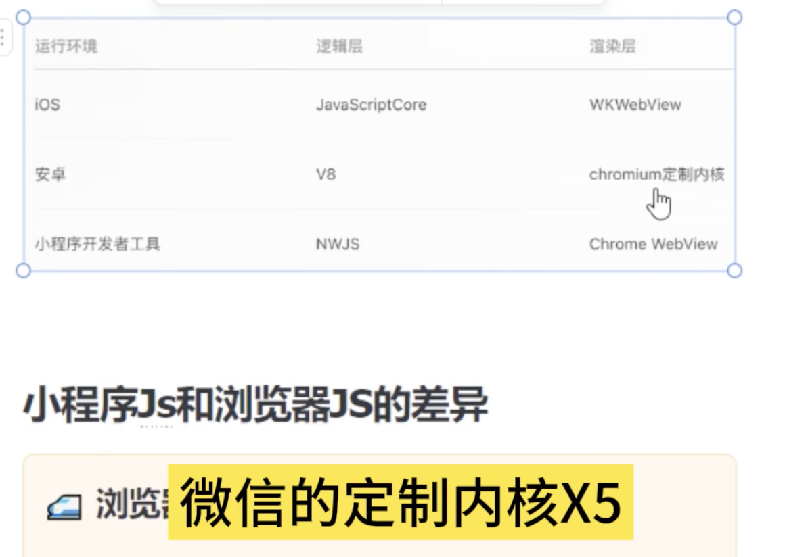

# 小程序
[小程序底层架构剖析](https://juejin.cn/post/7242328437243871288?searchId=2024101211214753C2BC0242E58D1F2E5B#heading-3)
[微信小程序底层框架实现原理｜万字长文](https://juejin.cn/post/7140509513852911647?searchId=202410121122031906A9EB56637937A22B#heading-0)
[浅析微信小程序的底层架构原理 ](https://www.cnblogs.com/goloving/p/14663950.html)
## **1.公众号存在的问题**
1. 公众号就是h5,微信团队内部通过`JS-SDK`以及后来的增强JS-SDK已经能够解决一些问题
2. 白屏过程，对于一些复杂页面，受限于设备性能和网络速度，白屏会更加明显
3. 缺少操作反馈，比如页面切换生硬以及点击所带来的迟滞感等等.

## **2.小程序要解决的问题**
1. 快速加载
2. 更强大的能力
3. 原生的体验
4. 易用且安全的微信数据开放
5. 高效，简单的开发
### 小程序为什么快（与普通h5相比）
1. 双线程，渲染层和逻辑层并行不阻塞
2. 多个webview，页面切换更流畅
3. webview 预加载
4. 安装包缓存
5. 以及微信做了大量的优化和看不见的操作
## **3.架构设计-双线程架构**

- 浏览器是一个单线程架构，主要原因是`js`允许访问操作`DOM`，因此`js`线程和渲染线程只能互斥运行。
- 微信小程序禁止`js`操作`DOM`

### 双线程优势
- 开发效率更高（解耦和松散耦合）
- 优化应用性能（运行在不同的线程中，可以同时渲染或者计算）
- 提高用户体验（ui和逻辑分离，避免页面长时间**阻塞**和卡顿）
- **安全性**

## 4.**渲染层**
- 在小程序中，逻辑层只有一个，但是渲染层有多个
- 如果为单页面应用，单独打开一个页面，需要先卸载当前页面结构，并重新渲染。
- 多页面应用，新页面直接滑动出来并且覆盖在旧页面上即可。这样用户体验非常好。
- 微信小程序做了限制，在微信小程序中打开的页面不能超过10个，达到10个页面后，就不能再打开新的页面。所以我们在开发中，要避免路由嵌套太深。
### 标签实现
为什么不用HTML语法和WebComponents来实现渲染，而是选择自定义？
管控与安全：web技术可以通过脚本获取修改页面敏感内容或者随意跳转其它页面
`Exparser`组件模型：Exparser组件模型参考了`shadow DOM`并进行了一些修改，像事件系统就是完全复刻的，slot插槽，属性传递等都基本一致。

### WXML编译
小程序中的`DOM`编译流程与`vue`类似，也会先将代码字符串编译为虚拟`DOM`，`WXML`最终会被编译为`JS`文件，然后插入到**渲染层**的`script`标签中。

### WXSS动态适配
- `WXSS`是小程序中使用的样式语言，`WXSS`具有`CSS`的大部分特性，同时它对CSS进行了扩充以及修改。
- `WXSS`同样会经过编译，最终的编译产物为`wxss.js`，不同于WXML通过`script`标签的形式插入到渲染层，`wxss.js`则是通过eval的方式注入到渲染层代码中。
- 小程序中使用的尺寸单位为`rpx（Responsive px）`，不同于h5中对于px的处理，需要使用postcss进行统一的转换，小程序底层已经为开发者做好了这层转换，那具体它是怎么做到的呢？
```js {.line-numbers}
var eps = le - 4; // 0.001
// 转化rpx单位方法，number的值则为rpx单位的具体数值。
var transformPX = window.__transformRpx_. || function (number, newDeviceWidth) {
    // 如果值为0直接返回0，因为Orpx = 0px
    if (number === 0) return 0;
    // 新值 = rpx值 / 基础设备宽度750 * 设备宽度。
    number = number / BASE_DEVICE_WIDTH * (newDevicewidth || devicewidth);
    // 返回小于等于 number + 0.001 的最大烧觊，用于收拢精度
    number = Math.floor(number + eps);
    if (number === 0) { // 如果number等于0,相当于 1rpx 在 iphone6上的显示判断
        if (deviceDPR === 1 || !isIos) { // 非IOS 或者 像示比为1的时候 返回 1
            return 1;
        } else {
            return 0.5;
        }
    }
    return number;
}
```

### 渲染层webview,`pageframe/instanceframe.html`的模板中注入的js
- `webviewId`：webview的唯一标识，当用户打开一个小程序页面的时候，相当于打开了一个webview，不同的webview用webviewid来区分;
- `wxAppCode`：整个页面的json wxss wxml编译之后都存储在这里;主要几个重要的函数和属性有:
  - decodeJsonPathName
  - json配置
  - wxml编译后的$gwx函数。
  - wxss编译后的eval函数。
- 当小程序需要打开某个页面的时候，只需要提取页面的这几个属性，注入到预加载的`html`模版中就可以快速生成一个新的`webview`

### 原生组件
小程序中的部分组件是由客户端创建的原生组件，并不完全在Exparser的渲染体系下，这些组件有
camera
canvas
input（仅在 focus 时表现为原生组件）
live-player
live-pusher
map
textarea
video
**引入原生组件主要有3个好处：**
1. 扩展Web的能力。比如像输入框组件（input, textarea）有更好地控制键盘的能力。
2. 体验更好，同时也减轻`WebView的`渲染工作。比如像地图组件（map）这类较复杂的组件，其渲染工作不占用WebView线程，而交给更高效的客户端原生处理。
3. 绕过`setData`、数据通信和重渲染流程，使渲染性能更好。比如像画布组件（canvas）可直接用一套丰富的绘图接口进行绘制。

### 快速启动: 小程序每个视图层页面内容都是通过pageframe.html模板来生成的。
- 首页启动时，即第一次通过`pageframe.html`生成内容后，后台服务会缓存`pageframe.html`模板首次生成的html内容
- 非首次新打开页面时，页面请求的`pageframe.html`内容直接走后台缓存
- 非首次新打开页面时，`pageframe.html`页面引入的外链js资源走本地缓存


## **5.渲染层如何向逻辑层通信？**
**渲染层**向**逻辑层**通信的方式就是采用**事件系统**
- 开发者在`DOM上`通过`@click`绑定事件，`WXML`文件被编译的时候，会通过`$gwx`函数生成虚拟`DOM`，然后小程序执行的时候渲染层底层基础库会对虚拟`DOM`进行解析，事件绑定最终会以`attr`属性的形式生成到虚拟`DOM`中，所以底层基础库通过`applyPropeties`解析事件并通过`addEventListener`绑定到相应DOM并声明回调。
- 用户点击相应`DOM`时，`Exparser`组件系统接收到这个事件，然后开始执行回调。回调函数中对函数的event信息进行组装，并触发`sendData`方法。
- 目前在触发`sendData`方法之前这些逻辑的解析包括`event`参数的组装都是在渲染层的底层基础库`WAWebview.js`中完成的，也就是说还在渲染线程中。
- 回调函数在**逻辑层**，事件的触发在**渲染层**，此时，小程序会通过`sendData`发送`event`数据到逻辑层，这个时候`WeixinJSBridge`就派上用场了，渲染层调用`publish`方法发送数据，逻辑层通过`registercallback`进行监听，并执行相应的回调。此时，渲染层到逻辑层的通信流程结束。
- 逻辑层改变数据之后，同样是触发`sendData`方法，然后渲染层通过`subscribe`进行监听，从`eventname`和触发事件时候记录的回调函数来判断是哪个事件被触发了，从而获取动态数据。

### 特殊场景
如果业务场景为手势识别之类的，监听事件不断的触发，数据不断的改变。
这样的业务场景中，我们可以想像，如果坐标值不断改变的话，在逻辑与视图分开的双线程架构中，线程与线程之间的通讯是**非常频繁**的，会有很大的性能问题。
所以我们可以看到微信开放了一个标记，可以在**渲染层写部分js逻辑**。这样话就可以在渲染层单独处理频繁改变的数据，就避免了线程与线程之间频繁通讯导致的性能和延时问题。


## **6.第三方小程序框架**
1. 第一类是**预编译框架**，预编译框架就是在执行前就进行编译。像我司在17年开发“转转二手交易网”的时候使用的wepy框架就属于预编译框架。预编译框架也有一些显而易见的缺点，这类预编译框架要么是类vue，要么是类React，如果后期vue或者React再出一些新特性的话，预编译框架就要进行扩展编写；还有一些兼容问题，对于小程序本身不支持的一些属性，预编译框架需要进行兼容；
2. 第二类是**半编译半运行框架**，像美团的mpvue就是此类框架，半编译指的是vue的template需要单独编译为wxml，半运行讲的是vue整体的特性都会在逻辑层中运行。为了符合小程序的渲染框架，修改了vue的框架；
3. 第三类是**运行时框架**，像Remax就是运行时框架，它可以使开发者使用完整的React语法来开发小程序。因为小程序框架本身是不支持js直接操作DOM的，那Remax框架是如何解决这个问题的呢？其实它自己复刻了一套操作DOM的API，例如appendChild，innterHtml等，但是它真正操作的并不是dom，而是data中的数据结构。从而达到了操作DOM的目的。使得自己真正成了一个运行时框架；

## **7.生命周期**
1. `onLoad(Object query)` 页面加载时触发，一个页面只会调用一次，可以在onLoad的参数中获取打开当前页面路径中的参数。
2. `onShow()` 页面显示/切入前台时触发
3. `onHide()` 页面隐藏/切入后台时触发。 如 wx.navigateTo 或底部 tab 切换到其他页面，小程序切入后台等。
4. `onReady()` 页面初次渲染完成时触发。一个页面只会调用一次，代表页面已经准备妥当，可以和视图层进行交互。
5. `onUnload()` 页面卸载时触发。如wx.redirectTo或wx.navigateBack到其他页面时。


